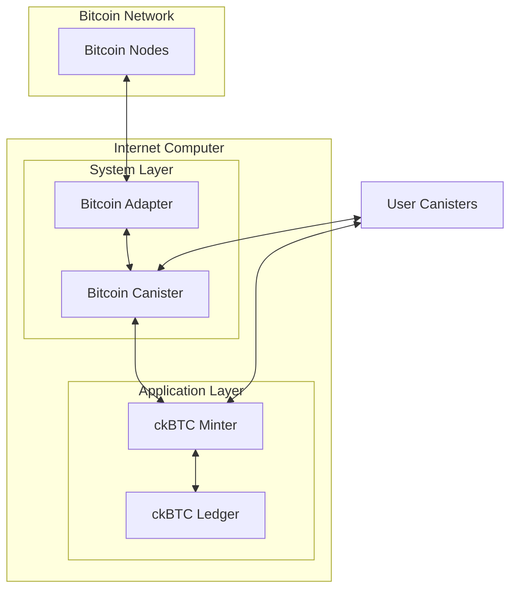

The Internet Computer integrates directly with the Bitcoin network, enabling canisters to hold, send, and receive Bitcoin without bridges or intermediaries. This integration powers ckBTC, a chain-key Bitcoin token backed 1:1 with BTC.

## Architecture Overview

The Bitcoin integration consists of three main components:

1. **Bitcoin Adapter** - Connects to the Bitcoin P2P network
2. **Bitcoin Canister** - System component that manages Bitcoin state
3. **ckBTC Minter** - Manages the ckBTC token and BTC custody



## Bitcoin Adapter

The Bitcoin adapter is a system process that interacts with the Bitcoin P2P network.

### Key Responsibilities

- **P2P Network Communication**: Connects to Bitcoin nodes using the Bitcoin P2P protocol
- **Block Synchronization**: Downloads and validates Bitcoin blocks and headers
- **Transaction Broadcasting**: Publishes signed transactions to the Bitcoin network
- **UTXO Management**: Tracks unspent transaction outputs

### Core Modules

#### BlockchainManager

Manages the local Bitcoin ledger and synchronization with peers.

```rust
// From rs/bitcoin/adapter/src/blockchainmanager.rs
pub struct BlockchainManager<Network: BlockchainNetwork> {
    blockchain: Arc<BlockchainState<Network>>,
    peer_info: HashMap<SocketAddr, PeerInfo>,
    getdata_request_info: LinkedHashMap<BlockHash, GetDataRequestInfo>,
    getheaders_requests: HashMap<SocketAddr, GetHeadersRequest>,
    block_sync_queue: LinkedHashSet<BlockHash>,
}
```

**Key features:**
- Tracks peer information and synchronization state
- Manages `getheaders` and `getdata` requests to peers
- Maintains a queue of blocks to download
- Implements timeout handling for unresponsive peers

#### BlockchainState

Stores the current state of the Bitcoin blockchain:

- Header cache for quick lookups
- Block cache for recent blocks
- Validation logic for headers and blocks

#### Connection Manager

Manages multiple connections to Bitcoin nodes:

- Establishes and maintains connections
- Routes messages to appropriate handlers
- Handles connection failures and reconnection

### Adapter Idle Mode

The adapter implements an idle mode to conserve resources when Bitcoin integration is disabled:

```rust
// From rs/bitcoin/adapter/src/lib.rs
pub struct AdapterState {
    idle_seconds: u64,
    last_received_rx: watch::Receiver<Option<Instant>>,
}

impl AdapterState {
    pub fn is_idle(&self) -> bool {
        match *self.last_received_rx.borrow() {
            Some(last) => last.elapsed().as_secs() >= idle_seconds,
            None => true,  // Idle on startup
        }
    }
}
```

## ckBTC Minter Canister

The ckBTC minter is a canister that manages the issuance and redemption of ckBTC tokens.

### State Management

```rust
// From rs/bitcoin/ckbtc/minter/src/state.rs
pub struct CkBtcMinterState {
    // Bitcoin network configuration
    pub btc_network: Network,
    pub min_confirmations: u32,
    
    // ECDSA key for signing transactions
    pub ecdsa_key_name: String,
    
    // UTXO management
    pub available_utxos: UtxoSet,
    pub utxos_state_addresses: BTreeMap<Account, UtxoSet>,
    
    // Withdrawal request queues
    pub pending_retrieve_btc_requests: Vec<RetrieveBtcRequest>,
    pub requests_in_flight: BTreeMap<u64, InFlightStatus>,
    pub submitted_transactions: Vec<SubmittedBtcTransaction>,
    
    // Fee estimation
    pub last_fee_per_vbyte: Vec<MillisatoshiPerVByte>,
    pub retrieve_btc_min_amount: u64,
}
```

### Deposit Flow

1. User transfers BTC to a unique deposit address derived from their principal
2. Minter monitors Bitcoin network for incoming transactions
3. After required confirmations, minter mints equivalent ckBTC to user's account

```rust
// User gets their Bitcoin address
let address = minter.get_btc_address(principal);

// Address is derived using ECDSA threshold signatures
let derivation_path = vec![ByteBuf::from(b"deposit"), ByteBuf::from(principal.as_slice())];
```

### Withdrawal Flow

1. User burns ckBTC tokens on the ledger
2. Minter receives burn notification and creates withdrawal request
3. Minter batches requests to optimize fees
4. Transaction is signed using threshold ECDSA
5. Signed transaction is broadcast to Bitcoin network

```rust
// From rs/bitcoin/ckbtc/minter/src/lib.rs
async fn submit_pending_requests<R: CanisterRuntime>(runtime: &R) {
    // Check if we can form a batch
    if !state::read_state(|s| s.can_form_a_batch(MIN_PENDING_REQUESTS, runtime.time())) {
        return;
    }
    
    // Estimate fees
    let fee_millisatoshi_per_vbyte = match estimate_fee_per_vbyte(runtime).await {
        Some(fee) => fee,
        None => return,
    };
    
    // Build unsigned transaction
    let batch = state.build_batch(MAX_REQUESTS_PER_BATCH);
    let (unsigned_tx, change_output, total_fee, utxos) = 
        build_unsigned_transaction(/* ... */);
    
    // Sign and submit
    let signed_tx = runtime.sign_transaction(/* ... */).await?;
    runtime.send_raw_transaction(signed_tx_bytes, btc_network).await?;
}
```

### UTXO Selection Algorithm

The minter uses a greedy algorithm for UTXO selection:

```rust
// From rs/bitcoin/ckbtc/minter/src/lib.rs
fn utxos_selection(target: u64, available_utxos: &mut UtxoSet, output_count: usize) -> Vec<Utxo> {
    // Greedy selection: pick smallest UTXOs that cover the target
    let mut input_utxos = greedy(target, available_utxos);
    
    // If managing many UTXOs, match input count to output count
    if available_utxos.len() > UTXOS_COUNT_THRESHOLD {
        while input_utxos.len() < output_count + 1 {
            if let Some(min_utxo) = available_utxos.pop_first() {
                input_utxos.push(min_utxo);
            } else {
                break;
            }
        }
    }
    
    input_utxos
}
```

### Transaction Building

```rust
// From rs/bitcoin/ckbtc/minter/src/lib.rs
pub fn build_unsigned_transaction<F: FeeEstimator>(
    available_utxos: &mut UtxoSet,
    outputs: Vec<(BitcoinAddress, Satoshi)>,
    main_address: &BitcoinAddress,
    max_num_inputs_in_transaction: usize,
    fee_rate: FeeRate,
    fee_estimator: &F,
) -> Result<(UnsignedTransaction, ChangeOutput, WithdrawalFee, Vec<Utxo>), BuildTxError> {
    // Select UTXOs
    let inputs = utxos_selection(amount, available_utxos, outputs.len());
    
    // Calculate fees
    let minter_fee = fee_estimator.evaluate_minter_fee(inputs.len(), outputs.len() + 1);
    
    // Build transaction with change output
    let change_output = ChangeOutput {
        vout: outputs.len() as u32,
        value: change + minter_fee,
    };
    
    // Create unsigned transaction
    let unsigned_tx = UnsignedTransaction {
        inputs: /* ... */,
        outputs: /* ... */,
        lock_time: 0,
    };
    
    Ok((unsigned_tx, change_output, total_fee, inputs))
}
```

### Replace-by-Fee (RBF)

The minter implements Replace-by-Fee to handle stuck transactions:

```rust
// From rs/bitcoin/ckbtc/minter/src/lib.rs
const MIN_RESUBMISSION_DELAY: Duration = Duration::from_secs(24 * 60 * 60);

async fn finalize_requests<R: CanisterRuntime>(runtime: &R) {
    // Check for transactions that should have finalized
    let maybe_finalized_transactions = /* get stuck transactions */;
    
    // Wait at least MIN_RESUBMISSION_DELAY before replacing
    maybe_finalized_transactions
        .retain(|_txid, tx| tx.submitted_at + MIN_RESUBMISSION_DELAY.as_nanos() as u64 <= now);
    
    // Resubmit with higher fees
    let new_fee_rate = old_fee_rate + MIN_RELAY_FEE_RATE_INCREASE;
    resubmit_transactions(/* ... */).await;
}
```

## Bitcoin Service

The Bitcoin service provides the gRPC interface between the adapter and the Bitcoin canister:

```rust
// From rs/bitcoin/service/src/lib.rs
tonic::include_proto!("btc_service.v1");
```

This handles:
- Block and header requests
- Transaction submission
- UTXO queries
- Fee percentile estimation

## Key Features

### Threshold ECDSA

All Bitcoin addresses and signatures use threshold ECDSA:
- No single node has access to private keys
- Signatures are computed via multi-party computation
- Keys are derived using hierarchical deterministic (HD) paths

### Fee Estimation

Dynamic fee estimation based on Bitcoin network conditions:

```rust
pub async fn estimate_fee_per_vbyte<R: CanisterRuntime>(runtime: &R) -> Option<FeeRate> {
    let fees = runtime.get_current_fee_percentiles(/* ... */).await?;
    let fee_estimator = state::read_state(|s| runtime.fee_estimator(s));
    fee_estimator.estimate_median_fee(&fees)
}
```

### UTXO Consolidation

Automatic consolidation when UTXO count exceeds threshold:

```rust
const DEFAULT_UTXO_CONSOLIDATION_THRESHOLD: usize = 10_000;
const MIN_CONSOLIDATION_INTERVAL: Duration = Duration::from_secs(24 * 60 * 60);
```

## Security Considerations

### Multi-Network Support

Supports Bitcoin mainnet, testnet, and regtest:

```rust
pub enum Network {
    Mainnet,
    Testnet,
    Regtest,
}
```

### Address Validation

All Bitcoin addresses are validated before processing:
- P2PKH (Pay-to-PubKey-Hash)
- P2SH (Pay-to-Script-Hash)  
- P2WPKH (Pay-to-Witness-PubKey-Hash)
- P2WSH (Pay-to-Witness-Script-Hash)

### KYC/AML Integration

Optional integration with Know-Your-Transaction (KYT) providers:

```rust
pub struct RetrieveBtcRequest {
    pub amount: u64,
    pub address: BitcoinAddress,
    pub block_index: u64,
    pub kyt_provider: Option<Principal>,
}
```

## Performance Optimizations

### Batching

Withdrawal requests are batched to reduce fees:

```rust
pub const MIN_PENDING_REQUESTS: usize = 20;
pub const MAX_REQUESTS_PER_BATCH: usize = 100;
```

### Caching

Header and block caching for fast lookups:
- Header cache stores validated headers
- Block cache stores recent blocks
- Transaction store for pending transactions

### Idle Mode

Adapter enters idle mode when unused to conserve resources on subnets without Bitcoin integration enabled.

## Related Documentation

- [Threshold Signatures](/architecture/threshold-signatures)
- [Crypto Layer](/architecture/crypto-layer)
- [DKG](/architecture/dkg)