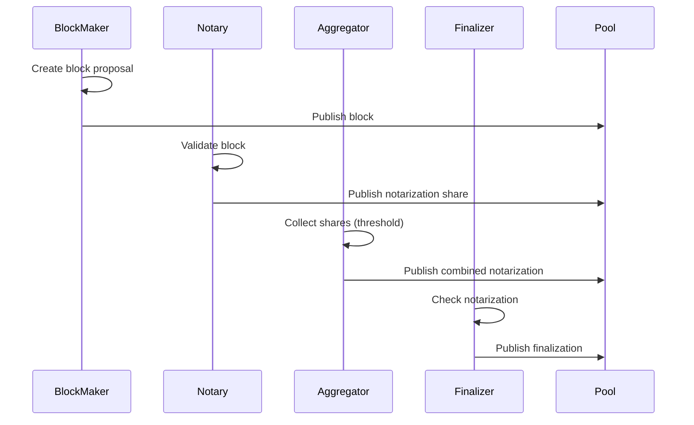

The Internet Computer implements a novel Byzantine Fault Tolerant (BFT) consensus protocol that enables subnets to reach agreement on blocks and state transitions in a decentralized manner.

## Overview

The consensus layer is responsible for establishing distributed consensus among replica nodes within a subnet. It coordinates the creation, validation, and finalization of blocks that contain user requests and system messages.

**Location**: `rs/consensus/`

## Architecture Components

The consensus implementation consists of multiple specialized subcomponents that work together:

### Core Subcomponents

```rust
pub struct ConsensusImpl {
    notary: Notary,
    finalizer: Finalizer,
    random_beacon_maker: RandomBeaconMaker,
    random_tape_maker: RandomTapeMaker,
    block_maker: BlockMaker,
    catch_up_package_maker: CatchUpPackageMaker,
    validator: Validator,
    aggregator: ShareAggregator,
    purger: Purger,
    // ...
}
```

*Reference*: `rs/consensus/src/consensus.rs:130`

#### 1. Block Maker

Creates new blocks containing:
- Ingress messages (user requests)
- XNet messages (cross-subnet communication)
- Self-validating payloads
- DKG dealings and other consensus artifacts

#### 2. Notary

Provides notarization - the first level of consensus:
- Validates proposed blocks
- Creates notarization shares
- Aggregates shares into full notarizations

#### 3. Finalizer

Finalizes blocks after they receive sufficient notarizations:
- Ensures blocks are committed and cannot be reverted
- Triggers execution and state advancement
- Maintains finalized height tracking

#### 4. Random Beacon Maker

Generates verifiable random beacons:
- Produces unpredictable randomness for each round
- Uses threshold signatures for security
- Enables leader selection and other protocol functions

#### 5. Random Tape Maker

Creates random tapes used for:
- Execution environment randomness
- Fair scheduling of canister execution

#### 6. Catch-Up Package (CUP) Maker

Creates periodic checkpoints enabling nodes to:
- Synchronize with the subnet after being offline
- Bootstrap new nodes joining the subnet
- Recover from temporary network partitions

#### 7. Validator

Validates all consensus artifacts:
- Blocks and their payloads
- Notarizations and finalizations
- Random beacons and tapes
- Ensures cryptographic validity and protocol compliance

#### 8. Share Aggregator

Combines individual threshold signature shares:
- Aggregates notarization shares
- Aggregates finalization shares
- Creates combined signatures when threshold is reached

#### 9. Purger

Maintains bounded pool size:
- Removes artifacts below finalized height
- Prevents memory exhaustion
- Keeps consensus pool compact

## Consensus Flow

### Block Production and Finalization



### Height-Based Protocol

The consensus protocol operates in rounds based on block heights:

1. **Height H**: Current finalized height
2. **Height H+1**: Block proposals and notarizations
3. **Height H+2**: Finalization of H+1 block

### Pool Architecture

All consensus artifacts are stored in the **Consensus Pool**:

- **Validated Pool**: Artifacts that passed validation
- **Unvalidated Pool**: Newly received artifacts pending validation

Artifacts flow: `Unvalidated → Validated → Finalized → Purged`

## Safety Guarantees

### Bounded Gaps

The protocol enforces limits to maintain bounded state:

```rust
// Maximum gap between notarization and certification
const ACCEPTABLE_NOTARIZATION_CERTIFICATION_GAP: u64 = 70;

// Maximum gap between notarization and CUP
const ACCEPTABLE_NOTARIZATION_CUP_GAP: u64 = 130;
```

*Reference*: `rs/consensus/src/consensus.rs:75-82`

### Byzantine Fault Tolerance

The protocol tolerates up to f Byzantine nodes where:
- Subnet size n > 3f
- Threshold t = f + 1
- Honest majority required for progress

## Payload Builder

The `PayloadBuilderImpl` coordinates creation of block payloads:

```rust
pub struct PayloadBuilderImpl {
    ingress_selector: Arc<dyn IngressSelector>,
    xnet_payload_builder: Arc<dyn XNetPayloadBuilder>,
    self_validating_payload_builder: Arc<dyn SelfValidatingPayloadBuilder>,
    canister_http_payload_builder: Arc<dyn BatchPayloadBuilder>,
    // ...
}
```

*Reference*: `rs/consensus/src/consensus.rs:188-199`

### Payload Types

1. **Ingress Messages**: User-submitted requests
2. **XNet Messages**: Cross-subnet calls
3. **Self-Validating**: System-generated messages
4. **Canister HTTP**: HTTPS outcalls
5. **Query Stats**: Usage metrics
6. **VetKD**: Verifiable encrypted threshold key derivation

## Execution Integration

Consensus and execution are tightly coupled:

```rust
struct ConsensusImpl {
    message_routing: Arc<dyn MessageRouting>,
    state_manager: Arc<dyn StateManager<State = ReplicatedState>>,
    // ...
}
```

1. **Block Creation**: Payload builder queries state for valid messages
2. **Block Finalization**: Triggers message routing and execution
3. **State Certification**: State manager certifies executed state
4. **Feedback Loop**: Execution results affect next block creation

## Membership and Registry

Consensus uses the **Registry** for:
- Subnet membership information
- Node public keys and network topology
- Protocol version and feature flags
- Threshold signature parameters

```rust
let membership = Arc::new(Membership::new(
    consensus_cache,
    registry_client.clone(),
    replica_config.subnet_id,
));
```

*Reference*: `rs/consensus/src/consensus.rs:180-184`

## Performance Optimization

### Thread Pool

Consensus uses a dedicated thread pool for parallel validation:

```rust
const MAX_CONSENSUS_THREADS: usize = 16;

pub fn build_thread_pool(num_threads: usize) -> Arc<ThreadPool> {
    Arc::new(
        ThreadPoolBuilder::new()
            .num_threads(num_threads)
            .build()
            .expect("Failed to create thread pool"),
    )
}
```

*Reference*: `rs/consensus/src/consensus.rs:85, 119-126`

### Round-Robin Scheduling

Subcomponents are invoked in round-robin order:
- Prevents starvation
- Ensures fair resource allocation
- Balances CPU time across components

## Testing Framework

The consensus crate includes a comprehensive test framework:

```bash
# Run multi-node simulation
RUST_LOG=Debug cargo test --test integration multiple_nodes_are_live -- --nocapture

# Configure test parameters
NUM_NODES=6 NUM_ROUNDS=100 RUST_LOG=Debug cargo test --test integration
```

*Reference*: `rs/consensus/README.adoc`

### Test Parameters

- `RANDOM_SEED`: Deterministic randomness seed
- `NUM_NODES`: Number of simulated nodes (default: 10)
- `NUM_ROUNDS`: Simulation duration in rounds
- `MAX_DELTA`: Maximum message latency (ms)
- `EXECUTION`: Execution strategy (GlobalMessage, GlobalClock, RandomExecute)
- `DELIVERY`: Message delivery strategy (Sequential, RandomReceive, RandomGraph)

## Metrics and Observability

Consensus exports comprehensive metrics:

```rust
struct ConsensusMetrics {
    on_state_change_duration: Histogram,
    on_state_change_processed: Histogram,
    // ... many more metrics
}
```

- Subcomponent execution times
- Artifact processing rates
- Pool sizes and growth
- Finalization latency
- Byzantine behavior detection

## Key Interfaces

### PoolMutationsProducer

Core trait for all consensus components:

```rust
pub trait PoolMutationsProducer<T> {
    type Mutations;
    
    fn on_state_change(&self, pool: &T) -> Self::Mutations;
}
```

Components react to pool changes by:
1. Reading current pool state
2. Computing desired mutations (additions, moves, removals)
3. Returning mutation set
4. Pool applies mutations atomically

## Related Components

- [Cryptography Layer](/architecture/crypto-layer) - Provides signatures and verification
- [Threshold Signatures](/architecture/threshold-signatures) - Enables distributed signing
- [DKG](/architecture/dkg) - Distributes keys to subnet members

## Further Reading

- [Consensus Test Framework Documentation](https://github.com/dfinity/ic/blob/master/rs/consensus/test_framework.adoc)
- [Internet Computer Consensus Protocol Blog Post](https://medium.com/dfinity/the-internet-computers-consensus-algorithm-2a3dc3f7f45f)
