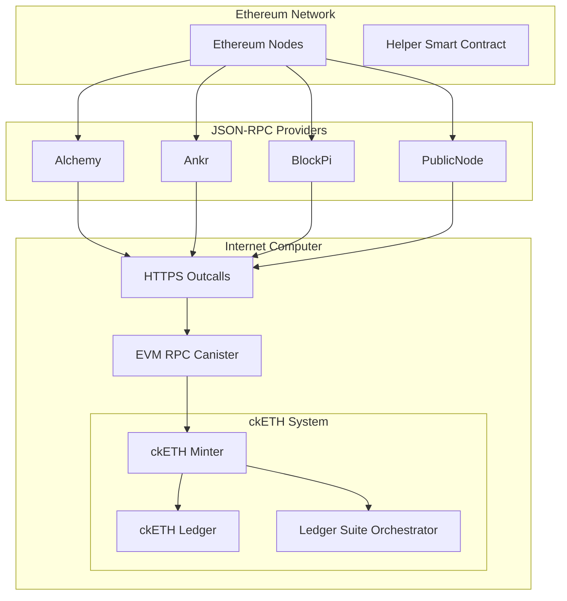

The Internet Computer integrates with the Ethereum network through HTTPS outcalls to JSON-RPC providers, enabling canisters to interact with Ethereum smart contracts. This powers ckETH (chain-key Ethereum) and ckERC20 tokens.

## Architecture Overview

The Ethereum integration consists of several components:

1. **EVM RPC Canister** - Communicates with Ethereum JSON-RPC providers
2. **ckETH Minter** - Manages ckETH and ckERC20 tokens
3. **ckETH Ledger** - ICRC-1 compliant ledger for ckETH
4. **Ledger Suite Orchestrator** - Manages deployment of new ckERC20 tokens



## EVM RPC Client

The ckETH minter communicates with Ethereum through the EVM RPC canister, which provides consensus over multiple JSON-RPC providers.

### Multi-Provider Consensus

```rust
// From rs/ethereum/cketh/minter/src/eth_rpc_client/mod.rs
pub fn rpc_client(state: &State) -> EvmRpcClient<IcRuntime, CandidResponseConverter, DoubleCycles> {
    const TOTAL_NUMBER_OF_PROVIDERS: u8 = 4;
    const MAX_NUM_RETRIES: u32 = 10;
    
    let providers = match chain {
        EthereumNetwork::Mainnet => EvmRpcServices::EthMainnet(None),
        EthereumNetwork::Sepolia => EvmRpcServices::EthSepolia(Some(vec![
            EthSepoliaService::BlockPi,
            EthSepoliaService::PublicNode,
            EthSepoliaService::Alchemy,
            EthSepoliaService::Ankr,
        ])),
    };
    
    let min_threshold = match chain {
        EthereumNetwork::Mainnet => 3_u8,
        EthereumNetwork::Sepolia => 2_u8,
    };
    
    EvmRpcClient::builder(IcRuntime::new(), evm_rpc_id)
        .with_rpc_sources(providers)
        .with_consensus_strategy(ConsensusStrategy::Threshold {
            total: Some(TOTAL_NUMBER_OF_PROVIDERS),
            min: min_threshold,
        })
        .with_retry_strategy(DoubleCycles::with_max_num_retries(MAX_NUM_RETRIES))
        .build()
}
```

**Key features:**
- **Multi-provider consensus**: Requires agreement from multiple providers
- **Automatic retries**: Doubles cycles on retry for rate-limited providers
- **Threshold strategy**: Configurable minimum number of agreeing providers
- **Network-specific configuration**: Different thresholds for mainnet vs. testnet

### Response Aggregation

```rust
// From rs/ethereum/cketh/minter/src/eth_rpc_client/mod.rs
pub struct MultiCallResults<T> {
    ok_results: BTreeMap<EvmRpcService, T>,
    errors: BTreeMap<EvmRpcService, RpcError>,
}

impl<T: PartialEq> MultiCallResults<T> {
    fn at_least_two_ok(self) -> Result<BTreeMap<EvmRpcService, T>, MultiCallError<T>> {
        match self.ok_results.len() {
            0 => Err(self.expect_error()),
            1 => Err(MultiCallError::InconsistentResults(self)),
            _ => Ok(self.ok_results),
        }
    }
}
```

## ckETH Minter

The ckETH minter manages the lifecycle of ckETH and ckERC20 tokens.

### State Management

```rust
// From rs/ethereum/cketh/minter/src/state.rs
pub struct State {
    pub ethereum_network: EthereumNetwork,
    pub ecdsa_key_name: String,
    pub cketh_ledger_id: Principal,
    
    // Event scraping
    pub log_scrapings: LogScrapings,
    pub first_scraped_block_number: BlockNumber,
    pub last_observed_block_number: Option<BlockNumber>,
    
    // Deposit tracking
    pub events_to_mint: BTreeMap<EventSource, ReceivedEvent>,
    pub minted_events: BTreeMap<EventSource, MintedEvent>,
    pub invalid_events: BTreeMap<EventSource, InvalidEventReason>,
    
    // Withdrawal tracking
    pub eth_transactions: EthTransactions,
    
    // Balance management
    pub eth_balance: EthBalance,
    pub erc20_balances: Erc20Balances,
    
    // Multi-token support
    pub ckerc20_tokens: DedupMultiKeyMap<Principal, Address, CkTokenSymbol>,
    pub ledger_suite_orchestrator_id: Option<Principal>,
    pub evm_rpc_id: Principal,
}
```

### Log Scraping

The minter continuously scrapes Ethereum logs for deposit events:

```rust
// Scraping configuration
pub const SCRAPING_ETH_LOGS_INTERVAL: Duration = Duration::from_secs(3 * 60);
```

**Process:**
1. Query latest Ethereum block number
2. Scrape logs from last scraped block to current block
3. Parse deposit events from logs
4. Validate and process deposits
5. Update last scraped block number

### Deposit Flow (ckETH)

1. User sends ETH to the helper smart contract with their principal encoded in the transaction
2. Helper contract emits a `ReceivedEth` event
3. Minter scrapes Ethereum logs and detects the event
4. After sufficient confirmations, minter mints ckETH to user's account

```rust
// Event structure
pub struct ReceivedEvent {
    pub transaction_hash: String,
    pub block_number: BlockNumber,
    pub log_index: LogIndex,
    pub from_address: Address,
    pub value: Wei,
    pub principal: Principal,
}
```

### Deposit Flow (ckERC20)

1. User approves helper contract to spend their ERC20 tokens
2. User calls deposit function on helper contract
3. Helper contract transfers tokens and emits `ReceivedErc20` event
4. Minter scrapes logs and processes deposit
5. Minter mints equivalent ckERC20 tokens

### Withdrawal Flow

1. User burns ckETH/ckERC20 tokens
2. Minter creates withdrawal request with destination Ethereum address
3. Minter estimates gas fees and builds transaction
4. Transaction is signed using threshold ECDSA
5. Signed transaction is sent to Ethereum via JSON-RPC
6. Minter monitors transaction status and handles failures

```rust
// Withdrawal request structure
pub struct WithdrawalRequest {
    pub ledger_burn_index: LedgerBurnIndex,
    pub destination: Address,
    pub withdrawal_amount: Wei,
    pub created_at: u64,
}
```

### Transaction Management

The minter tracks Ethereum transactions through multiple states:

```rust
pub enum EthTransactions {
    Pending(WithdrawalRequest),
    Sent {
        withdrawal_id: LedgerBurnIndex,
        transaction_hash: String,
        transaction: SignedTransaction,
    },
    Finalized {
        withdrawal_id: LedgerBurnIndex,
        transaction_receipt: TransactionReceipt,
    },
}
```

**Transaction lifecycle:**
1. **Created**: Withdrawal request created from burn
2. **Pending**: Waiting for gas estimation and signing
3. **Sent**: Transaction submitted to Ethereum
4. **Mined**: Transaction included in block
5. **Finalized**: Transaction has sufficient confirmations

### Gas Fee Estimation

Dynamic gas fee estimation using EIP-1559:

```rust
pub struct GasFeeEstimate {
    pub max_fee_per_gas: Wei,
    pub max_priority_fee_per_gas: Wei,
    pub gas_limit: u64,
}
```

**Process:**
1. Query current base fee from latest block
2. Estimate max priority fee from provider
3. Calculate total max fee: `base_fee * 2 + max_priority_fee`
4. Apply safety margin for fee volatility

### Nonce Management

Sequential nonce assignment for Ethereum transactions:

```rust
pub struct TransactionNonce(u64);

// Nonce is incremented for each new transaction
impl State {
    fn next_transaction_nonce(&mut self) -> TransactionNonce {
        let nonce = self.current_nonce;
        self.current_nonce = self.current_nonce.checked_add(1).expect("nonce overflow");
        nonce
    }
}
```

## Multi-Token Support

The minter supports multiple ERC20 tokens through a configurable token registry:

```rust
// From rs/ethereum/cketh/minter/src/erc20.rs
pub struct CkErc20Token {
    pub ledger_canister_id: Principal,
    pub erc20_contract_address: Address,
    pub symbol: CkTokenSymbol,
}

// Dual-key map for efficient lookups
pub ckerc20_tokens: DedupMultiKeyMap<Principal, Address, CkTokenSymbol>
```

**Lookup capabilities:**
- By ledger canister ID
- By ERC20 contract address
- Ensures no duplicates

## Ledger Suite Orchestrator

The orchestrator manages the lifecycle of ckERC20 token deployments:

```rust
// From rs/ethereum/ledger-suite-orchestrator/src/state/mod.rs
pub struct ManagedCanisterIds {
    pub ledger: Option<CanisterId>,
    pub index: Option<CanisterId>,
    pub archives: Vec<CanisterId>,
}

pub struct ManagedCkErc20Token {
    pub erc20_contract_address: Address,
    pub canisters: ManagedCanisterIds,
    pub token_symbol: String,
}
```

**Responsibilities:**
- Deploy ledger canisters for new ckERC20 tokens
- Deploy index canisters for transaction lookups
- Manage archive canisters for historical data
- Register new tokens with the minter

## Event Processing

### Event Types

```rust
pub enum ReceivedEvent {
    Eth {
        transaction_hash: String,
        block_number: BlockNumber,
        log_index: LogIndex,
        from_address: Address,
        value: Wei,
        principal: Principal,
    },
    Erc20 {
        transaction_hash: String,
        block_number: BlockNumber,
        log_index: LogIndex,
        from_address: Address,
        value: Erc20Value,
        principal: Principal,
        erc20_contract_address: Address,
    },
}
```

### Event Validation

Events are validated before minting:

```rust
pub enum InvalidEventReason {
    /// Deposit is invalid (e.g., invalid principal)
    InvalidDeposit(String),
    
    /// Deposit is quarantined due to processing error
    QuarantinedDeposit,
}
```

**Validation checks:**
- Principal can be decoded from transaction data
- Amount is positive and within bounds
- Event source is unique (no duplicates)
- Smart contract address matches expected address

## Ethereum Network Support

Supports multiple Ethereum networks:

```rust
pub enum EthereumNetwork {
    Mainnet,
    Sepolia,
}
```

**Network-specific configuration:**
- Different JSON-RPC providers per network
- Different consensus thresholds
- Different helper contract addresses
- Different confirmation requirements

## Security Features

### Threshold ECDSA

All Ethereum addresses and signatures use threshold ECDSA:
- Minter address derived from subnet's threshold ECDSA public key
- Transactions signed via multi-party computation
- No single node has access to private keys

### Deposit Address Derivation

User principals are encoded in transaction data rather than using unique addresses:
- Reduces number of addresses to monitor
- Simplifies log scraping
- Helper contract validates and emits events

### Reimbursement Handling

Automatic reimbursement for failed withdrawals:

```rust
pub struct ReimbursedWithdrawal {
    pub withdrawal_id: LedgerBurnIndex,
    pub reimbursed_amount: Wei,
    pub reimbursed_in_block: LedgerMintIndex,
    pub transaction_hash: Option<String>,
}
```

## Performance Optimizations

### Batched Log Queries

Logs are scraped in batches to reduce RPC calls:

```rust
const MAX_BLOCK_RANGE: u64 = 1000;

// Query logs in chunks
for block_range in (from_block..=to_block).step_by(MAX_BLOCK_RANGE) {
    let logs = eth_get_logs(contract_address, block_range).await?;
    process_logs(logs);
}
```

### Response Size Estimation

Dynamic estimation of response sizes to optimize cycles:

```rust
pub const HEADER_SIZE_LIMIT: u64 = 2 * 1024;
pub const ETH_GET_LOGS_INITIAL_RESPONSE_SIZE_ESTIMATE: u64 = 100;
```

### Skipped Blocks

Tracking of blocks with no relevant events to avoid reprocessing:

```rust
pub skipped_blocks: BTreeMap<Address, BTreeSet<BlockNumber>>
```

## Timer Tasks

Periodic tasks for automation:

```rust
pub const SCRAPING_ETH_LOGS_INTERVAL: Duration = Duration::from_secs(3 * 60);
pub const PROCESS_ETH_RETRIEVE_TRANSACTIONS_INTERVAL: Duration = Duration::from_secs(6 * 60);
pub const PROCESS_REIMBURSEMENT: Duration = Duration::from_secs(3 * 60);
pub const MINT_RETRY_DELAY: Duration = Duration::from_secs(3 * 60);
```

**Tasks:**
- Scrape Ethereum logs for deposits
- Process pending withdrawals
- Finalize mined transactions
- Retry failed operations
- Process reimbursements

## Related Documentation

- [HTTPS Outcalls](/architecture/https-outcalls)
- [Threshold Signatures](/architecture/threshold-signatures)
- [Crypto Layer](/architecture/crypto-layer)
- [Ledger Types](/packages/ledger-types)