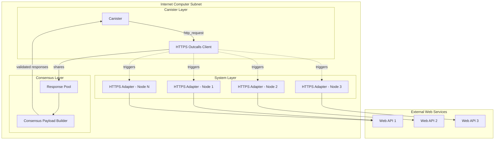

HTTPS outcalls enable canisters to make secure HTTP requests to external web services, allowing the Internet Computer to integrate with any web API or blockchain. This is a fundamental capability that powers integrations like ckETH, oracles, and cross-chain bridges.

## Architecture Overview

The HTTPS outcalls system consists of three main components:

1. **HTTPS Outcalls Client** - Canister-side API for making requests
2. **HTTPS Outcalls Consensus** - Consensus layer for aggregating responses
3. **HTTPS Outcalls Adapter** - System component that executes HTTP requests



## How It Works

### Request Flow

1. **Canister initiates request**: Canister calls `http_request()` management canister method
2. **Request distribution**: Each replica node receives the request
3. **Adapter execution**: Each node's HTTPS adapter makes the HTTP request independently
4. **Response collection**: Nodes share their responses via consensus
5. **Consensus validation**: Consensus layer validates and aggregates responses
6. **Callback execution**: Canister receives the agreed-upon response

### Consensus Process

The consensus layer ensures deterministic execution despite non-deterministic responses:

```rust
// From rs/https_outcalls/consensus/src/payload_builder.rs
pub struct CanisterHttpPayloadBuilderImpl {
    pool: Arc<RwLock<dyn CanisterHttpPool>>,
    cache: Arc<dyn ConsensusPoolCache>,
    crypto: Arc<dyn ConsensusCrypto>,
    state_reader: Arc<dyn StateReader<State = ReplicatedState>>,
    membership: Arc<Membership>,
    subnet_id: SubnetId,
    registry: Arc<dyn RegistryClient>,
}
```

**Key responsibilities:**
- Collect response shares from nodes
- Validate cryptographic signatures
- Check for consensus threshold
- Detect and handle divergent responses
- Build consensus payload for execution

## HTTPS Outcalls Adapter

The adapter is a system process that executes HTTP requests on behalf of canisters.

### Core Implementation

```rust
// From rs/https_outcalls/adapter/src/lib.rs
pub fn start_server(
    log: &ReplicaLogger,
    metrics_registry: &MetricsRegistry,
    rt_handle: &tokio::runtime::Handle,
    config: Config,
) {
    let canister_http = CanisterHttp::new(config.clone(), log, metrics_registry);
    
    let server = Server::builder()
        .timeout(Duration::from_secs(config.http_request_timeout_secs))
        .add_service(HttpsOutcallsServiceServer::new(canister_http));
    
    rt_handle.spawn(server.serve_with_incoming(incoming));
}
```

### HTTP Client Configuration

```rust
// From rs/https_outcalls/adapter/src/rpc_server.rs
pub struct CanisterHttp {
    client: Client<HttpsConnector<HttpConnector>, OutboundRequestBody>,
    cache: Arc<RwLock<Cache>>,
    logger: ReplicaLogger,
    metrics: AdapterMetrics,
    http_connect_timeout_secs: u64,
}

impl CanisterHttp {
    pub fn new(config: Config, logger: ReplicaLogger, metrics: &MetricsRegistry) -> Self {
        // Setup HTTP connector with timeout
        let mut http_connector = HttpConnector::new();
        http_connector.set_connect_timeout(
            Some(Duration::from_secs(config.http_connect_timeout_secs))
        );
        
        // Setup HTTPS with native root certificates
        let https_connector = HttpsConnectorBuilder::new()
            .with_native_roots()
            .expect("Failed to set native roots")
            .enable_all_versions()
            .wrap_connector(http_connector);
        
        // Build client with HTTP/2 support
        let client = Client::builder(TokioExecutor::new())
            .http2_max_header_list_size(MAX_HEADER_LIST_SIZE)
            .build(https_connector);
        
        Self { client, cache, logger, metrics, http_connect_timeout_secs }
    }
}
```

### SOCKS Proxy Support

The adapter supports routing requests through SOCKS proxies:

```rust
// From rs/https_outcalls/adapter/src/rpc_server.rs
const MAX_SOCKS_PROXY_TRIES: usize = 2;

async fn do_https_outcall_socks_proxy(
    &self,
    socks_proxy_addrs: Vec<String>,
    request: http::Request<Full<Bytes>>,
) -> Result<http::Response<Incoming>, String> {
    let mut socks_proxy_addrs = socks_proxy_addrs.to_owned();
    socks_proxy_addrs.shuffle(&mut thread_rng());
    
    for socks_proxy_addr in &socks_proxy_addrs {
        let socks_proxy_uri: Uri = socks_proxy_addr.parse()?;
        let socks_client = self.get_socks_client(socks_proxy_uri);
        
        match socks_client.request(request.clone()).await {
            Ok(resp) => return Ok(resp),
            Err(e) => continue,
        }
    }
    
    Err("All SOCKS proxies failed".to_string())
}
```

**Features:**
- Multiple SOCKS proxy support
- Random proxy selection
- Automatic failover
- Client caching for performance

### Request Validation

The adapter validates and sanitizes all requests:

```rust
// Header limits
const HEADERS_LIMIT: usize = 1_024;
const HEADER_NAME_VALUE_LIMIT: usize = 8_192;
const MAX_HEADER_LIST_SIZE: u32 = 52 * 1024;

// User agent injection
const USER_AGENT_ADAPTER: &str = "ic/1.0";
```

**Validation checks:**
- Maximum number of headers (1,024)
- Maximum header name/value size (8 KiB)
- Total header size limit (52 KiB)
- Valid HTTP method
- Valid URI format
- Host classification (IPv4, IPv6, domain name)

### Metrics Collection

The adapter collects detailed metrics for monitoring:

```rust
pub struct AdapterMetrics {
    request_duration_histogram: HistogramVec,
    connection_errors: IntCounterVec,
    timeout_errors: IntCounter,
    socks_cache_size: IntGauge,
    socks_cache_misses: IntCounter,
}
```

**Tracked metrics:**
- Request duration by phase (connect, upload, download)
- HTTP method distribution
- URL format classification
- Header and body sizes
- Connection errors
- SOCKS proxy performance

## Consensus Layer

The consensus layer implements a Byzantine fault-tolerant protocol for response aggregation.

### Payload Builder

```rust
// From rs/https_outcalls/consensus/src/payload_builder.rs
impl CanisterHttpPayloadBuilderImpl {
    fn get_canister_http_payload_impl(
        &self,
        height: Height,
        validation_context: &ValidationContext,
        delivered_ids: HashSet<CallbackId>,
        max_payload_size: NumBytes,
    ) -> CanisterHttpPayload {
        // Get consensus threshold
        let threshold = self.membership
            .get_committee_threshold(height, Committee::CanisterHttp)?;
        
        // Get registry version
        let consensus_registry_version = registry_version_at_height(
            self.cache.as_ref(),
            height,
        )?;
        
        // Collect and validate shares
        let grouped_shares = group_shares_by_callback_id(&pool_reader);
        
        // Aggregate responses that meet threshold
        for (callback_id, shares) in grouped_shares {
            if shares.len() >= threshold {
                let response = self.aggregate(registry_version, metadata, shares, content)?;
                payload.responses.push(response);
            }
        }
        
        payload
    }
}
```

### Response Aggregation

Multiple strategies for handling responses:

```rust
enum CandidateOrDivergence {
    // Consensus response from multiple nodes
    Candidate(
        (
            CanisterHttpResponseMetadata,
            BTreeSet<BasicSignature<CanisterHttpResponseMetadata>>,
            CanisterHttpResponse,
        ),
    ),
    
    // Detected divergence in responses
    Divergence(CanisterHttpResponseDivergence),
}
```

**Aggregation process:**
1. Group response shares by callback ID
2. Count identical responses
3. Check if threshold is met
4. If consensus: aggregate signatures and return response
5. If divergence: return divergence response with all variants

### Timeout Handling

```rust
pub const CANISTER_HTTP_TIMEOUT_INTERVAL: Duration = Duration::from_secs(300);
pub const CANISTER_HTTP_MAX_RESPONSES_PER_BLOCK: usize = 100;
```

Requests that don't reach consensus within the timeout are marked as timed out.

## Client API

Canisters interact with HTTPS outcalls through the management canister API.

### Setup

```rust
// From rs/https_outcalls/client/src/lib.rs
pub fn setup_canister_http_client(
    rt_handle: tokio::runtime::Handle,
    metrics_registry: &MetricsRegistry,
    adapter_config: AdaptersConfig,
    transform_handler: TransformExecutionService,
    max_canister_http_requests_in_flight: usize,
    log: ReplicaLogger,
) -> Box<dyn NonBlockingChannel<CanisterHttpRequest, Response = CanisterHttpResponse>> {
    // Connect to adapter via Unix domain socket
    let endpoint = Endpoint::try_from("http://[::]:50151")
        .executor(ExecuteOnTokioRuntime(rt_handle.clone()));
    
    let channel = endpoint.connect_with_connector_lazy(service_fn(move |_: Uri| {
        let uds_path = uds_path.clone();
        async move {
            Ok::<_, std::io::Error>(hyper_util::rt::TokioIo::new(
                UnixStream::connect(uds_path).await?
            ))
        }
    }));
    
    Box::new(CanisterHttpAdapterClientImpl::new(
        rt_handle,
        channel,
        transform_handler,
        max_canister_http_requests_in_flight,
        metrics_registry.clone(),
        log,
    ))
}
```

### Request Structure

```rust
pub struct CanisterHttpRequest {
    pub url: String,
    pub method: HttpMethod,
    pub headers: Vec<HttpHeader>,
    pub body: Option<Vec<u8>>,
    pub max_response_bytes: Option<u64>,
    pub transform: Option<TransformContext>,
}
```

### Response Structure

```rust
pub struct CanisterHttpResponse {
    pub status: u32,
    pub headers: Vec<HttpHeader>,
    pub body: Vec<u8>,
}
```

## Transform Function

Canisters can provide a transform function to process responses before consensus:

```rust
pub struct TransformContext {
    pub function: WasmClosure,
    pub context: Vec<u8>,
}
```

**Purpose:**
- Remove non-deterministic fields (e.g., timestamps, request IDs)
- Extract only needed data to reduce payload size
- Normalize response format
- Enable consensus on otherwise divergent responses

**Example use case:**
```rust
// Transform removes timestamp from API response
fn transform(raw_response: CanisterHttpResponse) -> CanisterHttpResponse {
    let json: Value = serde_json::from_slice(&raw_response.body)?;
    let data = json["data"].clone();
    
    CanisterHttpResponse {
        status: raw_response.status,
        headers: vec![],
        body: serde_json::to_vec(&data)?,
    }
}
```

## Security Features

### Request Authorization

Only authorized canisters can make HTTPS outcalls:
- Controlled by subnet configuration
- Rate limiting per canister
- Cycle payment required

### Response Validation

Multiple layers of validation:
- Signature verification on response shares
- Threshold consensus requirement
- Timeout protection
- Size limits enforcement

### Privacy Protection

**SOCKS proxy routing:**
- Prevents external services from identifying individual nodes
- Distributes requests across proxies
- Protects subnet topology

**No correlation:**
- Each node makes independent request
- No shared session state
- Different source IPs via proxies

## Pricing Model

HTTPS outcalls are priced based on:

```rust
// From rs/https_outcalls/pricing/src/lib.rs
pub struct HttpOutcallPricing {
    pub base_cost: u64,
    pub per_byte_cost: u64,
    pub per_request_cost: u64,
}
```

**Cost factors:**
- Base cost per request
- Request size (headers + body)
- Response size
- Number of nodes making request

## Performance Optimizations

### Connection Pooling

HTTP connections are pooled and reused:

```rust
type Cache = BTreeMap<String, Client<HttpsConnector<SocksConnector<HttpConnector>>, OutboundRequestBody>>;
```

### Request Batching

Consensus payloads batch multiple responses:

```rust
pub const CANISTER_HTTP_MAX_RESPONSES_PER_BLOCK: usize = 100;
```

### Adaptive Payload Sizing

Dynamic adjustment of max payload size based on response characteristics.

## Error Handling

Comprehensive error handling for various failure modes:

```rust
pub enum CanisterHttpErrorKind {
    // Connection errors
    ConnectionError,
    TimeoutError,
    
    // Response errors  
    InvalidHttpResponse,
    ResponseTooLarge,
    
    // Consensus errors
    NoConsensus,
    Timeout,
}
```

**Error scenarios:**
- Network connectivity failures
- DNS resolution failures
- TLS handshake failures
- HTTP protocol errors
- Timeout expiration
- Divergent responses
- Transform function failures

## Use Cases

### Blockchain Integration

- Query Ethereum/Bitcoin JSON-RPC endpoints
- Fetch transaction status
- Monitor smart contract events
- Submit signed transactions

### Oracle Services

- Fetch price feeds
- Get weather data
- Query exchange rates
- Access real-world data

### Web2 Integration

- Call REST APIs
- Authenticate with OAuth
- Fetch social media data
- Integrate payment processors

## Configuration

```rust
pub struct Config {
    pub http_request_timeout_secs: u64,
    pub http_connect_timeout_secs: u64,
    pub socks_proxy_addrs: Vec<String>,
    pub incoming_source: IncomingSource,
}

pub enum IncomingSource {
    Path(PathBuf),
    Systemd,
}
```

## Monitoring and Observability

Comprehensive metrics for monitoring:

- Request count and rate
- Success/failure rates
- Latency percentiles
- Payload sizes
- Consensus metrics
- Adapter health

## Related Documentation

- [Ethereum Integration](/architecture/ethereum-integration)
- [Bitcoin Integration](/architecture/bitcoin-integration)
- [Consensus Layer](/architecture/consensus-layer)