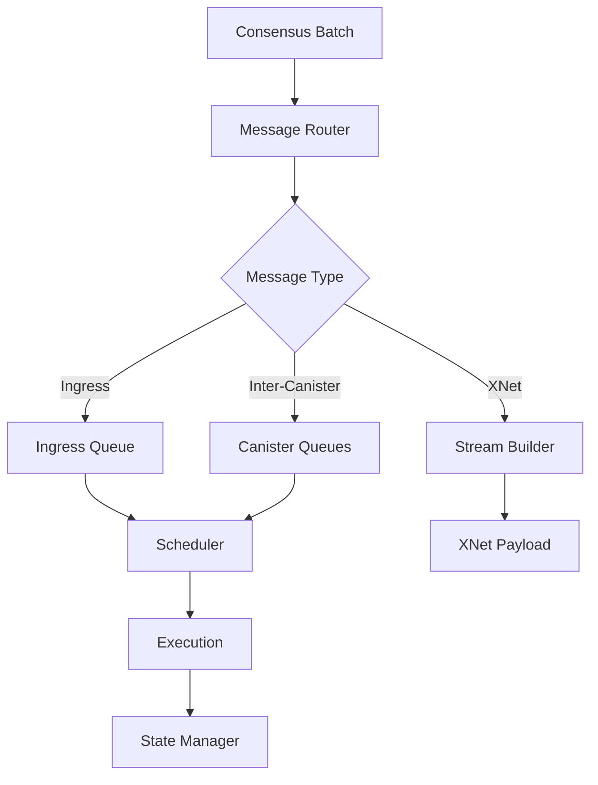

Message routing is responsible for delivering messages between canisters within a subnet and across subnets (XNet). It orchestrates the execution of consensus-agreed batches and maintains message queues.

## Overview

The message routing layer sits between consensus and execution, processing batches of messages and coordinating state transitions. It ensures that all messages are delivered reliably and in the correct order.

<Info>
Message routing is deterministic - all nodes in a subnet process batches identically to maintain state consistency.
</Info>

## Core Responsibilities

- **Batch Processing**: Process consensus-agreed batches of messages
- **Intra-Subnet Routing**: Route messages between canisters on the same subnet
- **Cross-Subnet Routing**: Handle XNet messages to/from other subnets
- **Queue Management**: Maintain input/output queues for all canisters
- **Stream Building**: Create XNet streams for cross-subnet communication
- **Scheduling**: Coordinate with scheduler for canister execution

## Architecture

### MessageRoutingImpl Structure

The main message routing component:

```rust
pub struct MessageRoutingImpl {
    state_manager: Arc<dyn StateManager>,
    certified_stream_store: Arc<dyn CertifiedStreamStore>,
    scheduler: Box<dyn Scheduler>,
    ingress_history_writer: Arc<IngressHistoryWriterImpl>,
    hypervisor_config: HypervisorConfig,
    cycles_account_manager: Arc<CyclesAccountManager>,
    subnet_id: SubnetId,
    metrics: MessageRoutingMetrics,
    log: ReplicaLogger,
    registry: Arc<dyn RegistryClient>,
    malicious_flags: MaliciousFlags,
}
```

Location: `rs/messaging/src/message_routing.rs`

### Message Flow Pipeline



## Batch Processing

The message router processes batches in a deterministic sequence:

### Process Batch Flow

<Accordion title="Batch Processing Steps">
1. **Load State**: Retrieve latest replicated state
2. **Validate Batch**: Verify batch height and content
3. **Induct Messages**: Add messages to queues
   - Ingress messages → canister input queues
   - Inter-canister messages → canister output queues
   - XNet messages → stream headers
4. **Execute Round**: Invoke scheduler to execute canisters
5. **Build Streams**: Create XNet streams for outgoing messages
6. **Update Registry**: Update network topology from registry
7. **Commit State**: Persist updated state via state manager

Location: `rs/messaging/src/message_routing.rs:process_batch()`
</Accordion>

### Batch Content Types

<Accordion title="Batch Contents">
```rust
pub struct BatchContent {
    pub ingress: Vec<SignedIngress>,
    pub xnet: BTreeMap<SubnetId, XNetPayload>,
    pub self_validating: SelfValidatingPayload,
    pub query_stats: QueryStatsPayload,
    pub subnet_available_memory: SubnetAvailableMemory,
    pub registry_version: RegistryVersion,
}
```

- **ingress**: User-submitted messages
- **xnet**: Cross-subnet messages from other subnets
- **self_validating**: Bitcoin, ECDSA, etc.
- **query_stats**: Query execution statistics
- **registry_version**: Network configuration version

Location: `rs/types/types/src/batch.rs`
</Accordion>

## Intra-Subnet Message Routing

Messages between canisters on the same subnet are routed efficiently:

### Canister Queue System

<Accordion title="Queue Types">
Each canister maintains several queues:

- **Input Queue**: Incoming requests and responses
- **Output Queues**: Outgoing messages per destination
- **Ingress Queue**: User-submitted ingress messages

Queues are managed by the `CanisterQueues` data structure.

Location: `rs/replicated_state/src/canister_state/queues/`
</Accordion>

### Message Induction

Inducting messages into queues:

<Accordion title="Induction Process">
1. **Verify Sender**: Check sender authorization
2. **Check Capacity**: Ensure queue has space
3. **Reserve Slots**: Reserve memory for message
4. **Add to Queue**: Insert message in FIFO order
5. **Update Metrics**: Track queue depths

Failed induction results in message rejection or requeueing.

Location: `rs/messaging/src/routing/demux.rs`
</Accordion>

### Scheduling Integration

The message router coordinates with the scheduler:

<Accordion title="Scheduler Coordination">
```rust
pub fn execute_round(
    state: ReplicatedState,
    randomness: Randomness,
    current_round: ExecutionRound,
    ...
) -> ReplicatedState
```

The scheduler:
1. Selects canisters to execute
2. Pulls messages from input queues
3. Executes canister code
4. Pushes responses to output queues
5. Returns updated state

Location: `rs/execution_environment/src/scheduler/`
</Accordion>

## Cross-Subnet Message Routing (XNet)

XNet enables communication between subnets:

### XNet Streams

Messages are bundled into streams between subnet pairs:

<Accordion title="Stream Structure">
```rust
pub struct Stream {
    messages: StreamIndexedQueue<RequestOrResponse>,
    signals_end: StreamIndex,
}
```

- **messages**: Queue of inter-canister messages
- **signals_end**: Acknowledgment of received messages

Each subnet pair has two streams (A→B and B→A).

Location: `rs/replicated_state/src/metadata_state/stream.rs`
</Accordion>

### Stream Builder

Creates outgoing XNet messages:

<Accordion title="Stream Building Process">
1. **Collect Messages**: Gather messages destined for other subnets
2. **Apply Limits**: Enforce stream size and message count limits
3. **Build Slices**: Create stream slices for each destination subnet
4. **Compute Hash**: Hash stream contents for certification
5. **Update State**: Update stream headers in replicated state

Location: `rs/messaging/src/routing/stream_builder.rs`
</Accordion>

### Stream Handler

Processes incoming XNet messages:

<Accordion title="Stream Handling Steps">
1. **Receive Slice**: Get certified stream slice from XNet payload
2. **Verify Certification**: Validate threshold signature
3. **Check Hash**: Verify slice hash matches certification
4. **Induct Messages**: Add messages to canister input queues
5. **Signal Progress**: Update signals_end to acknowledge receipt

Location: `rs/messaging/src/routing/stream_handler.rs`
</Accordion>

### XNet Payload Builder

Consensus component that fetches XNet slices:

<Accordion title="Payload Builder Responsibilities">
- Query peer subnets for available streams
- Fetch certified stream slices
- Validate certifications
- Build XNet payload for consensus block
- Manage concurrent requests to multiple subnets

Location: `rs/xnet/payload_builder/src/`
</Accordion>

## Registry Integration

The message router updates network topology from the registry:

### Network Topology

<Accordion title="Topology Information">
```rust
pub struct NetworkTopology {
    pub subnets: BTreeMap<SubnetId, SubnetTopology>,
    pub routing_table: RoutingTable,
    pub canister_migrations: BTreeMap<CanisterIdRange, Vec<SubnetId>>,
    pub nns_subnet_id: SubnetId,
    pub ecdsa_signing_subnets: BTreeMap<EcdsaKeyId, Vec<SubnetId>>,
}
```

- **subnets**: All subnets and their node lists
- **routing_table**: Canister ID to subnet mapping
- **canister_migrations**: Canister migration history
- **nns_subnet_id**: Root subnet ID
- **ecdsa_signing_subnets**: Threshold ECDSA key locations

Location: `rs/replicated_state/src/metadata_state/network_topology.rs`
</Accordion>

### Registry Updates

Topology is updated every batch:

<Accordion title="Update Process">
1. **Read Registry**: Query registry at batch's registry version
2. **Build Topology**: Construct NetworkTopology from registry data
3. **Detect Changes**: Compare with previous topology
4. **Update State**: Store new topology in replicated state
5. **Handle Splits**: Detect and handle subnet splits/migrations

Location: `rs/messaging/src/message_routing.rs:update_network_topology()`
</Accordion>

## Ingress Message Handling

User-submitted ingress messages receive special handling:

### Ingress Induction

<Accordion title="Ingress Processing">
1. **Signature Verification**: Already done by ingress filter
2. **Deduplication**: Check ingress history for duplicates
3. **Queue Insertion**: Add to canister's ingress queue
4. **Status Update**: Mark as "Received" in ingress history
5. **Execution**: Scheduler picks up for execution
6. **Result Recording**: Update ingress history with result

Location: `rs/messaging/src/routing/demux.rs`
</Accordion>

### Ingress History Writer

Tracks ingress message lifecycle:

<Accordion title="Ingress Status States">
- **Received**: Message inducted into queue
- **Processing**: Currently executing
- **Completed**: Successfully executed
- **Failed**: Execution failed with error
- **Unknown**: Not found (expired or never submitted)

Location: `rs/execution_environment/src/history.rs`
</Accordion>

## Message Timeouts

Messages have time-to-live to prevent indefinite queueing:

### Timeout Handling

<Accordion title="Timeout Mechanisms">
Inter-canister messages:
- Default timeout: 5 minutes
- Configurable per message
- Timed-out requests generate automatic reject responses

Ingress messages:
- Fixed timeout: 5 minutes from submission
- Expired ingress is removed from queues
- Status becomes "Unknown"

Location: `rs/messaging/src/routing/utils.rs`
</Accordion>

## Message Scheduling

The scheduler determines execution order:

### Valid Set Rule

Determines which canisters are ready to execute:

<Accordion title="Valid Set Criteria">
A canister is in the valid set if:
- Has messages in input queue
- Has sufficient cycles for execution
- Not frozen or stopping
- Has available heap memory
- No pending upgrades blocking execution

Location: `rs/messaging/src/scheduling/valid_set_rule.rs`
</Accordion>

### Scheduling Strategies

<Accordion title="Scheduler Strategies">
- **Round-Robin**: Fair scheduling across all canisters
- **Priority-Based**: Higher priority canisters first
- **Opportunistic**: Fill available capacity
- **Long-Running**: Support for DTS (Deterministic Time Slicing)

Location: `rs/execution_environment/src/scheduler/`
</Accordion>

## Performance Optimizations

### Stream Batching

<Accordion title="Batching Benefits">
- Bundle multiple messages per stream slice
- Reduce certification overhead
- Amortize network transfer costs
- Improve throughput for high-traffic subnets
</Accordion>

### Queue Pooling

<Accordion title="Message Pool">
Messages are stored in a shared pool:
- Reduces memory allocation overhead
- Enables efficient message deduplication
- Supports reference counting for shared messages

Location: `rs/replicated_state/src/canister_state/queues/message_pool.rs`
</Accordion>

### Concurrent Processing

<Accordion title="Parallelization">
Where determinism allows:
- Parallel signature verification
- Concurrent XNet slice fetching
- Multi-threaded canister execution (within scheduler)
</Accordion>

## Metrics and Monitoring

Extensive metrics for message routing:

### Key Metrics

<Accordion title="Message Routing Metrics">
- `mr_deliver_batch_count`: Batches delivered (success/failure)
- `mr_expected_batch_height`: Expected next batch height
- `mr_process_batch_duration_seconds`: Batch processing time
- `mr_time_in_stream`: Message latency in XNet streams
- `mr_time_in_backlog`: Queue waiting time
- `mr_timed_out_messages_total`: Messages that timed out

Location: `rs/messaging/src/message_routing.rs:70-110`
</Accordion>

### Stream Metrics

<Accordion title="XNet Stream Metrics">
- Stream sizes by destination subnet
- Messages per stream
- Certification latency
- Failed inductions
- Signals end indices
</Accordion>

## Error Handling

Robust error handling ensures reliability:

### Critical Errors

<Accordion title="Critical Error Types">
- `mr_non_increasing_batch_time`: Batch time went backwards
- `mr_induct_response_failed`: Failed to induct response
- `mr_failed_to_read_registry_error`: Registry read failure
- `mr_empty_canister_allocation_range`: Invalid canister ranges

These trigger alerts and may halt the subnet.

Location: `rs/messaging/src/message_routing.rs:124-133`
</Accordion>

## Related Components

- [Replica Architecture](/architecture/replica) - Overall system structure  
- [Execution Environment](/architecture/execution-environment) - Message execution
- [State Manager](/architecture/state-manager) - State persistence