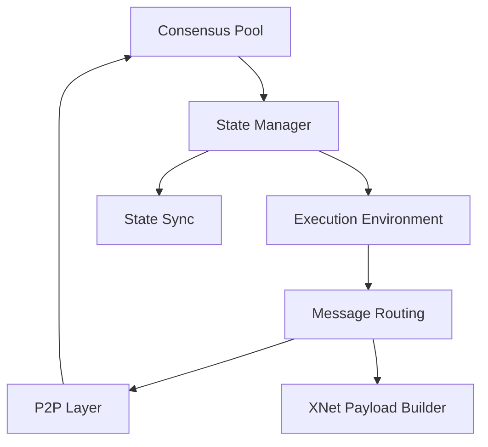

The replica is the core binary that runs on every node in the Internet Computer network. It orchestrates all components necessary to execute smart contracts, reach consensus, and maintain the replicated state.

## Overview

The replica binary (`ic-replica`) is a multi-threaded application built in Rust that integrates multiple subsystems including consensus, execution, state management, and networking. Each replica node runs this binary to participate in subnet operations.

<Note>
The replica is designed with fault tolerance and determinism as core principles. All components execute deterministically to ensure state replication across subnet nodes.
</Note>

## Replica Initialization

The replica initialization sequence is defined in `main.rs` and follows a carefully orchestrated startup process:

### Startup Sequence

<Accordion title="1. Process Group Setup">
The replica creates a new process group to ensure all child processes (sandboxed canister execution, crypto operations) belong to the same group for proper resource management.

```rust
setpgid(Pid::from_raw(0), Pid::from_raw(0))
```

Location: `rs/replica/bin/replica/main.rs:73`
</Accordion>

<Accordion title="2. Runtime Creation">
The replica creates **four separate Tokio runtimes** as a risk mitigation strategy to prevent bugs in one component from blocking others:

- **Main Runtime**: Inter-process communication (crypto, networking adapters)
- **P2P Runtime**: Peer-to-peer networking
- **HTTP Runtime**: Serving user requests
- **XNet Runtime**: Cross-subnet communication

Each runtime is configured with worker threads based on available CPU cores:

```rust
let rt_worker_threads = std::cmp::max(num_cpus::get() / 4, 2);
```

Location: `rs/replica/bin/replica/main.rs:95-127`
</Accordion>

<Accordion title="3. Configuration Loading">
The replica loads its configuration from the filesystem, including:
- Logger configuration
- Metrics registry setup
- Network topology
- Subnet configuration
- Cryptographic keys

Location: `rs/replica/bin/replica/main.rs:167-174`
</Accordion>

<Accordion title="4. Catch-Up Package (CUP)">
The replica loads a Catch-Up Package containing:
- Initial blockchain state hash
- Registry version
- Subnet membership
- Initial consensus state

This allows new or restarting nodes to join the subnet at a known good state.

Location: `rs/replica/bin/replica/main.rs:180-183`
</Accordion>

<Accordion title="5. Crypto & Registry Setup">
Initializes the cryptographic component and registry client for:
- Threshold signatures
- Node authentication
- Network topology queries

Location: `rs/replica/bin/replica/main.rs:202-207`
</Accordion>

<Accordion title="6. IC Stack Construction">
The core IC stack is constructed, integrating all major components:

```rust
ic_replica::setup_ic_stack::construct_ic_stack(
    &logger,
    &metrics_registry,
    rt_main.handle(),
    rt_p2p.handle(),
    rt_http.handle(),
    rt_xnet.handle(),
    config,
    node_id,
    subnet_id,
    registry,
    crypto,
    cup_proto,
    tracing_handle,
)
```

Location: `rs/replica/bin/replica/main.rs:276-291`
</Accordion>

## IC Stack Components

The `construct_ic_stack` function assembles the complete replica architecture:

### Core Component Pipeline



### Component Initialization Order

<Accordion title="1. Consensus Pool">
Creates the persistent consensus artifact pool at the height determined by the CUP:

```rust
let consensus_pool = Arc::new(RwLock::new(ConsensusPoolImpl::new(
    node_id,
    subnet_id,
    catch_up_package_proto,
    artifact_pool_config,
    metrics_registry,
    log,
    time_source,
)));
```

Location: `rs/replica/src/setup_ic_stack.rs:146-163`
</Accordion>

<Accordion title="2. State Manager">
Initializes the state manager responsible for:
- Checkpoint creation and loading
- State synchronization
- Certified state hash computation

```rust
let state_manager = Arc::new(StateManagerImpl::new(
    verifier,
    subnet_id,
    subnet_type,
    log,
    metrics_registry,
    &config.state_manager,
    Some(consensus_pool_cache.starting_height()),
    malicious_flags,
));
```

Location: `rs/replica/src/setup_ic_stack.rs:168-180`
</Accordion>

<Accordion title="3. Execution Services">
Sets up the execution environment including:
- Hypervisor for WebAssembly execution
- Scheduler for canister round execution
- Query handler for non-replicated queries
- Ingress filter and history

```rust
let execution_services = ExecutionServices::setup_execution(
    log,
    metrics_registry,
    subnet_id,
    subnet_type,
    config.hypervisor,
    subnet_config,
    state_manager.clone(),
    state_manager.get_fd_factory(),
    completed_execution_messages_tx,
    &state_manager.state_layout().tmp(),
);
```

Location: `rs/replica/src/setup_ic_stack.rs:190-201`
</Accordion>

<Accordion title="4. Message Routing">
Creates the message router that:
- Processes batches from consensus
- Routes inter-canister messages
- Manages XNet streams
- Schedules canister execution

```rust
let message_router = MessageRoutingImpl::new(
    state_manager.clone(),
    certified_stream_store.clone(),
    execution_services.ingress_history_writer,
    execution_services.scheduler,
    config.hypervisor,
    execution_services.cycles_account_manager,
    subnet_id,
    metrics_registry,
    log,
    registry,
    malicious_flags,
);
```

Location: `rs/replica/src/setup_ic_stack.rs:217-229`
</Accordion>

<Accordion title="5. Consensus & P2P">
Final step constructs consensus and P2P networking layers:
- Block makers and validators
- Artifact pools and managers
- Gossip protocol handlers
- DKG and certification

Location: `rs/replica/setup_ic_network/src/lib.rs`
</Accordion>

## Runtime Architecture

### Thread Model

The replica employs a sophisticated multi-threaded architecture:

<Info>
**Separation of Concerns**: Each runtime is isolated to prevent resource contention and improve fault isolation.
</Info>

| Runtime | Purpose | Thread Count |
|---------|---------|-------------|
| Main | Crypto operations, IPC | `max(CPUs/4, 2)` |
| P2P | Gossip protocol, artifact transfer | `max(CPUs/4, 2)` |
| HTTP | Query calls, read requests | `max(CPUs/4, 2)` |
| XNet | Cross-subnet messaging | `max(CPUs/4, 2)` |

Location: `rs/replica/bin/replica/main.rs:95-127`

### Signal Handling

The replica installs custom signal handlers:

- **SIGPIPE**: Ignored to handle socket IPC failures gracefully
- **SIGINT/SIGTERM**: Triggers graceful shutdown

```rust
let sigpipe_handler = rt_main.block_on(async {
    signal(SignalKind::pipe())
        .expect("failed to install SIGPIPE signal handler")
});
```

Location: `rs/replica/bin/replica/main.rs:153-155`

## Memory Allocator

On Linux, the replica uses **jemalloc** as the global allocator for improved performance:

```rust
#[cfg(target_os = "linux")]
use tikv_jemallocator::Jemalloc;

#[cfg(target_os = "linux")]
#[global_allocator]
static ALLOC: Jemalloc = Jemalloc;
```

Location: `rs/replica/bin/replica/main.rs:28-31`

<Note>
jemalloc is not used on macOS as it causes LMDB database segmentation faults.
</Note>

## Metrics and Observability

The replica exports comprehensive metrics:

- **Replica version and binary hash**: Tracks deployed code version
- **Component-specific metrics**: Each subsystem exports detailed metrics
- **Jaeger tracing**: Optional distributed tracing support

```rust
metrics_registry.int_gauge_vec(
    "ic_replica_info",
    "version info for the internet computer replica running.",
    &["ic_active_version", "ic_replica_binary_hash"],
).with_label_values(&[
    ReplicaVersion::default().as_ref(),
    &get_replica_binary_hash().map(|x| x.1).unwrap_or_else(|_| "na".to_string()),
]).set(1);
```

Location: `rs/replica/bin/replica/main.rs:188-200`

## Shutdown Sequence

The replica runs until receiving a shutdown signal:

```rust
rt_main.block_on(async move {
    info!(logger, "IC Replica Running");
    shutdown_signal(logger.clone()).await
});
info!(save_logger, "IC Replica Terminating");
```

Location: `rs/replica/bin/replica/main.rs:314-321`

## Key Design Principles

1. **Deterministic Execution**: All state transitions are deterministic to ensure consensus
2. **Fault Isolation**: Multiple runtimes prevent cascading failures
3. **Graceful Degradation**: Components can fail independently without bringing down the replica
4. **Observability**: Comprehensive metrics and tracing for debugging
5. **Security**: Sandboxed execution with process isolation

## Related Components

- [Execution Environment](/architecture/execution-environment) - WebAssembly canister execution
- [State Manager](/architecture/state-manager) - Replicated state persistence
- [Message Routing](/architecture/message-routing) - Inter-canister communication