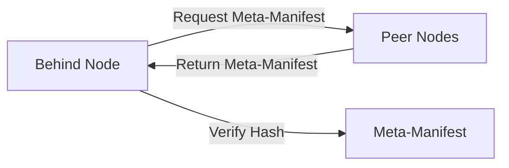
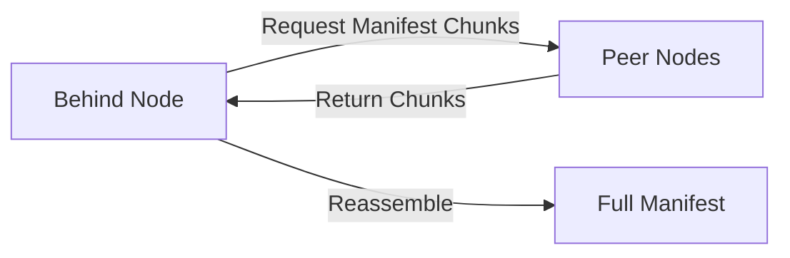
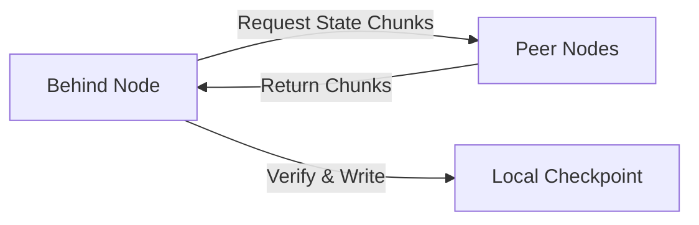

The state manager is responsible for persisting the replicated state to disk, creating checkpoints, computing state hashes for certification, and synchronizing state across subnet nodes.

## Overview

The state manager provides durable storage for the Internet Computer's replicated state while maintaining consistency across all nodes in a subnet. It bridges the gap between in-memory execution and persistent storage.

<Info>
The state manager ensures that even if a node crashes and restarts, it can recover to the correct state and continue participating in the subnet.
</Info>

## Core Responsibilities

- **Checkpointing**: Periodically persist replicated state to disk
- **State Hashing**: Compute cryptographic hashes for state certification
- **State Sync**: Synchronize state with other subnet nodes
- **Snapshot Management**: Maintain multiple state versions for consensus
- **Certified State**: Provide certified read access to state

## Architecture

### StateManagerImpl Structure

```rust
pub struct StateManagerImpl {
    log: ReplicaLogger,
    metrics: StateManagerMetrics,
    state_layout: StateLayout,
    states: Arc<parking_lot::RwLock<SharedState>>,
    verifier: Arc<dyn Verifier>,
    own_subnet_id: SubnetId,
    own_subnet_type: SubnetType,
    deallocator_thread: DeallocatorThread,
    latest_state_height: Arc<AtomicU64>,
    latest_certified_height: AtomicU64,
    fast_forward_height: AtomicU64,
    tip_channel: Sender<TipRequest>,
    _tip_thread_handle: JoinOnDrop<()>,
    fd_factory: Arc<dyn PageAllocatorFileDescriptor>,
    malicious_flags: MaliciousFlags,
    started_height: Height,
}
```

Location: `rs/state_manager/src/lib.rs:936-962`

### Shared State

The `SharedState` structure contains mutable state accessed across threads:

<Accordion title="SharedState Fields">
```rust
struct SharedState {
    certifications_metadata: CertificationsMetadata,
    certifications: Certifications,
    states_metadata: StatesMetadata,
    snapshots: VecDeque<Snapshot>,
    last_advertised: Height,
    fetch_state: Option<(Height, CryptoHashOfState, Height)>,
    tip_height: Height,
    tip: Option<ReplicatedState>,
}
```

- **certifications_metadata**: Hash trees and witnesses for certification
- **certifications**: Delivered certifications from consensus
- **states_metadata**: Checkpoint layouts, manifests, and root hashes
- **snapshots**: In-memory state snapshots
- **tip**: Current mutable state being modified

Location: `rs/state_manager/src/lib.rs:897-915`
</Accordion>

## Checkpoint Management

### Checkpoint Creation

Checkpoints are created at regular intervals (typically every 500 rounds):

<Accordion title="Checkpoint Creation Process">
1. **Freeze State**: Create immutable snapshot of current state
2. **Write to Disk**: Serialize state to checkpoint directory
   - Canister metadata (canister.pbuf)
   - Wasm modules (canister.wasm)
   - Memory pages (overlay files)
   - Queue state (queues.pbuf)
3. **Compute Manifest**: Hash all files and create manifest
4. **Verify Checkpoint**: Validate checkpoint integrity
5. **Mark as Verified**: Checkpoint becomes available for state sync

Location: `rs/state_manager/src/checkpoint.rs`
</Accordion>

### Checkpoint Layout

Checkpoints are stored in a structured directory layout:

```
state_root/
├── checkpoints/
│   ├── 000000000000010000/  # Height 10000
│   │   ├── system_metadata.pbuf
│   │   ├── subnet_queues.pbuf
│   │   └── canister_states/
│   │       └── 00000000000000010101/  # Canister ID
│   │           ├── canister.pbuf
│   │           ├── software.wasm
│   │           ├── vmemory_0.bin
│   │           └── stable_memory.bin
│   └── 000000000000010500/  # Height 10500
├── states_metadata.pbuf
└── tmp/
```

### Checkpoint Threads

Checkpoint operations are parallelized using a thread pool:

```rust
pub const NUMBER_OF_CHECKPOINT_THREADS: u32 = 16;
```

Location: `rs/state_manager/src/lib.rs:96`

## State Synchronization

State sync allows nodes to catch up when they fall behind:

### State Sync Protocol

<Accordion title="State Sync Phases">

**Phase 1: Meta-Manifest Download**


**Phase 2: Manifest Download**


**Phase 3: State Chunk Download**


Location: `rs/state_manager/src/state_sync/`
</Accordion>

### Chunk-based Transfer

State sync uses fixed-size chunks (1MB default) for efficient transfer:

<Accordion title="Chunk Types">
- **File Chunks**: Individual file chunks for large files
- **File Group Chunks**: Bundled small files (less than 8KB)
- **Manifest Chunks**: Manifest split into chunks
- **Meta-Manifest Chunk**: Single chunk containing manifest of manifests

Location: `rs/state_manager/src/state_sync/chunkable.rs`
</Accordion>

### State Sync Cache

The state sync cache reuses chunks from aborted syncs:

```rust
pub struct StateSyncCache {
    active: Arc<parking_lot::RwLock<Option<(Height, CryptoHashOfState)>>>,
    cache: Arc<parking_lot::RwLock<StateSyncCache>>,
}
```

Location: `rs/state_manager/src/lib.rs:873-886`

## State Hashing and Certification

### Hash Tree Computation

The state manager computes a Merkle tree over the certified state:

<Accordion title="Hash Tree Structure">
```
root_hash
├── subnet/
│   ├── canister_ranges
│   ├── public_key
│   └── metrics
└── canisters/
    ├── {canister_id_1}/
    │   ├── certified_data
    │   ├── module_hash
    │   └── metadata/
    └── {canister_id_2}/
        └── ...
```

Location: `rs/state_manager/src/tree_hash.rs`
</Accordion>

### Certification Metadata

Per-height certification data:

```rust
struct CertificationMetadata {
    hash_tree: Option<(Arc<HashTree>, Instant)>,
    certified_state_hash: CryptoHash,
    height_witness: Witness,
    certification: Option<Certification>,
}
```

Location: `rs/state_manager/src/lib.rs:846-861`

### Witness Generation

Witnesses prove that specific paths exist in the hash tree:

<Accordion title="Witness Use Cases">
- **Canister queries**: Prove certified data authenticity
- **Read state requests**: Prove request status
- **Subnet queries**: Prove subnet metadata
- **Cross-subnet messages**: Prove stream contents
</Accordion>

## Manifest System

Manifests describe checkpoint contents for state sync:

### Manifest Structure

<Accordion title="Manifest Components">
```rust
pub struct Manifest {
    version: u32,
    file_table: Vec<FileInfo>,
    chunk_table: Vec<ChunkInfo>,
}
```

- **file_table**: Maps files to their chunk ranges
- **chunk_table**: Hash and size of each chunk
- **version**: Manifest format version

Location: `rs/state_manager/src/manifest.rs`
</Accordion>

### Manifest Computation

Manifests are computed asynchronously after checkpoint creation:

<Accordion title="Manifest Computation Steps">
1. **Enumerate Files**: List all checkpoint files
2. **Split into Chunks**: Divide files into 1MB chunks
3. **Hash Chunks**: Compute SHA256 of each chunk
4. **Reuse Hashes**: Reuse chunk hashes from previous manifest when possible
5. **Build Tables**: Create file and chunk tables
6. **Encode Manifest**: Serialize to protobuf
7. **Create Meta-Manifest**: Split large manifests and create meta-manifest

Location: `rs/state_manager/src/manifest/`
</Accordion>

### Bundled Manifest

Bundles the manifest with root hash and meta-manifest:

```rust
pub(crate) struct BundledManifest {
    root_hash: CryptoHashOfState,
    manifest: Manifest,
    meta_manifest: Arc<MetaManifest>,
}
```

Location: `rs/state_manager/src/lib.rs:779-784`

## Tip Management

The "tip" is the current mutable state being modified:

### Tip Thread

A dedicated thread handles tip operations asynchronously:

<Accordion title="Tip Operations">
- **ResetTipAndMerge**: Initialize tip from checkpoint
- **FilterTipCanisters**: Remove canisters during subnet split
- **FlushPageMapToDisk**: Persist page map overlays
- **DefragmentTipPageMaps**: Optimize memory layout
- **SerializeToTip**: Update tip with new state

Location: `rs/state_manager/src/tip.rs`
</Accordion>

### Page Map Flushing

Page maps are periodically flushed to disk before checkpoints:

```rust
pub const NUM_ROUNDS_BEFORE_CHECKPOINT_TO_WRITE_OVERLAY: u64 = 50;
```

This reduces checkpoint creation time by avoiding large memory flushes.

Location: `rs/state_manager/src/lib.rs:133`

## Storage Optimizations

### Copy-on-Write Memory

<Accordion title="CoW Benefits">
- **Efficient Snapshots**: Multiple heights share unchanged pages
- **Fast Cloning**: State cloning doesn't copy memory
- **Reduced Disk Usage**: Hard links for identical files
- **Incremental Updates**: Only write modified pages

Location: `rs/replicated_state/src/page_map/`
</Accordion>

### Hard Linking

Identical files across checkpoints are hard-linked:

<Accordion title="Hard Link Candidates">
- Unchanged Wasm modules
- Unmodified stable memory
- Identical system metadata
- Shared queue data

This significantly reduces disk space usage.
</Accordion>

### Page Map Merging

Overlay files are merged to reduce file count and improve performance:

<Accordion title="Merge Strategy">
- **Age-based**: Merge old overlays
- **Size-based**: Merge small overlays
- **Fragmentation-based**: Merge fragmented overlays

Location: `rs/state_manager/src/lib.rs:298-340`
</Accordion>

## Metrics and Observability

The state manager exports extensive metrics:

### Key Metrics

<Accordion title="State Metrics">
- `state_manager_resident_state_count`: States in memory
- `state_manager_checkpoints_on_disk_count`: Verified checkpoints
- `state_manager_latest_certified_height`: Last certified height
- `state_manager_state_size_bytes`: Total state size
- `state_manager_manifest_chunk_bytes`: Chunk hashing metrics

Location: `rs/state_manager/src/lib.rs:357-521`
</Accordion>

### Performance Metrics

<Accordion title="Checkpoint Metrics">
- `state_manager_checkpoint_op_duration_seconds`: Checkpoint operation timing
- `state_manager_checkpoint_steps_duration_seconds`: Per-step timing
- `state_sync_duration_seconds`: State sync completion time
- `state_sync_remaining_chunks`: Chunks left to fetch

Location: `rs/state_manager/src/lib.rs:222-295`
</Accordion>

## Checkpoint Verification

Checkpoints go through verification before use:

<Accordion title="Verification Steps">
1. **Structural Validation**: Verify directory structure
2. **Protobuf Parsing**: Validate all .pbuf files
3. **Invariant Checking**: Verify state invariants
4. **Hash Validation**: Check manifest hashes (during state sync)
5. **Soft Invariants**: Log warnings for violated soft invariants

Location: `rs/state_manager/src/checkpoint.rs`
</Accordion>

## Diverged State Detection

The state manager detects and archives diverged states:

<Accordion title="Divergence Handling">
When a node computes a different state hash than certified:

1. **Mark as Diverged**: Move checkpoint to diverged directory
2. **Create Marker**: Create diverged state marker file
3. **Report Metric**: Update `last_diverged_state_timestamp` metric
4. **Trigger State Sync**: Fetch correct state from peers

Diverged states are kept for 30 days for debugging.

Location: `rs/state_manager/src/lib.rs:1089-1149`
</Accordion>

## Cleanup and Garbage Collection

The state manager automatically cleans up old states:

### Retention Policy

<Accordion title="What Gets Kept">
- **Latest checkpoint**: Always retained
- **Recent checkpoints**: Configurable number retained
- **Certified checkpoints**: Until newer certification arrives
- **Diverged states**: Kept for 30 days
- **Backups**: Kept for 30 days

Location: `rs/state_manager/src/lib.rs:119-149`
</Accordion>

## Related Components

- [Replica Architecture](/architecture/replica) - Overall system design
- [Execution Environment](/architecture/execution-environment) - State modifications
- [Message Routing](/architecture/message-routing) - State updates from batches