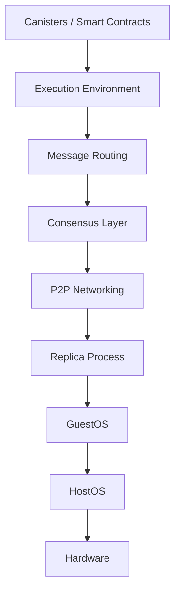
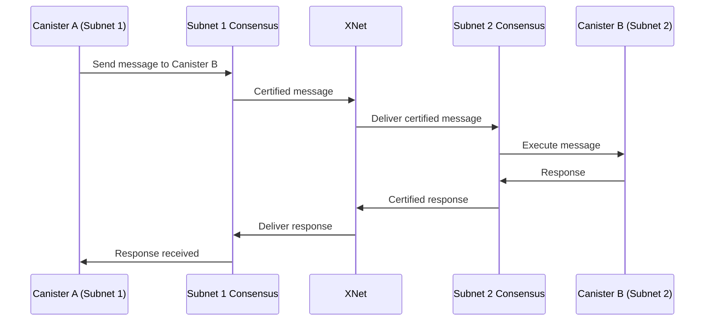

# Internet Computer Architecture

The Internet Computer is built as a sophisticated multi-layered system, from bare metal hardware to high-level smart contracts. Understanding this architecture is key to understanding how ICP achieves web-speed performance with decentralized security.

## Architectural Layers

The Internet Computer stack consists of several distinct layers, each with specific responsibilities:



## Layer 1: Hardware & Operating Systems

### IC-OS: Purpose-Built Operating Systems

The Internet Computer runs on purpose-built operating systems designed for security, reproducibility, and minimal attack surface.

<Info>
**IC-OS Overview** (from ic-os/README.adoc)

"IC-OS is an umbrella term for all the operating systems within the IC, including SetupOS, HostOS, GuestOS."
</Info>

<Steps>
  <Step title="SetupOS">
    **Role**: Initial bootstrap and installation
    
    - Boots on new replica nodes
    - Installs HostOS and GuestOS
    - One-time setup process
    
    ```bash
    # Build SetupOS dev image
    bazel build //ic-os/setupos/envs/dev/...
    ```
  </Step>
  
  <Step title="HostOS">
    **Role**: Minimal host environment
    
    - Runs on bare metal
    - Launches GuestOS in a virtual machine
    - Intentionally limited in capabilities (security by design)
    - No trusted operations
    
    <Warning>
    HostOS is deliberately minimal to reduce attack surface. It only manages the VM lifecycle.
    </Warning>
  </Step>
  
  <Step title="GuestOS">
    **Role**: Core protocol execution environment
    
    - Runs inside a VM on HostOS
    - Executes the IC replica process
    - Contains all consensus, execution, and networking logic
    - This is where the actual Internet Computer protocol runs
  </Step>
</Steps>

### Building IC-OS Images

IC-OS images are built reproducibly using Docker and Bazel:

<CodeGroup>
```dockerfile Base Image (Dockerfile.base)
# Takes care of installing all upstream Ubuntu packages
# Built weekly by CI, published to Docker Hub
# Ensures reproducible builds despite package updates
```

```dockerfile Main Image (Dockerfile)
# Builds off the published base image
# Configures and assembles the disk image
# All instructions must be reproducible
```
</CodeGroup>

<Tip>
The build process is split into two stages to maintain reproducibility. The base image freezes Ubuntu package versions, while the main image adds IC-specific components.
</Tip>

## Layer 2: The Replica Process

The replica is the heart of the Internet Computer - a sophisticated Rust program that implements the entire protocol.

### Main Entry Point

From `rs/replica/bin/replica/main.rs:1`:

```rust
//! Replica -- Internet Computer

use ic_config::Config;
use ic_crypto_sha2::Sha256;
use ic_http_endpoints_async_utils::{abort_on_panic, shutdown_signal};
use ic_logger::{info, new_replica_logger_from_config};
use ic_metrics::MetricsRegistry;
use ic_replica::setup;
```

### Multiple Tokio Runtimes

The replica uses **four separate Tokio async runtimes** as a risk mitigation strategy:

```rust
// From rs/replica/bin/replica/main.rs:98-127

// Runtime for inter-process communication - crypto, networking adapters
let rt_main = tokio::runtime::Builder::new_multi_thread()
    .worker_threads(rt_worker_threads)
    .thread_name("Main_Thread".to_string())
    .enable_all()
    .build()
    .unwrap();

// Runtime for P2P networking
let rt_p2p = tokio::runtime::Builder::new_multi_thread()
    .worker_threads(rt_worker_threads)
    .thread_name("P2P_Thread".to_string())
    .enable_all()
    .build()
    .unwrap();

// Runtime for serving user requests (HTTP)
let rt_http = tokio::runtime::Builder::new_multi_thread()
    .worker_threads(rt_worker_threads)
    .thread_name("HTTP_Thread".to_string())
    .enable_all()
    .build()
    .unwrap();

// Runtime for cross-subnet messaging (XNet)
let rt_xnet = tokio::runtime::Builder::new_multi_thread()
    .worker_threads(rt_worker_threads)
    .thread_name("XNet_Thread".to_string())
    .enable_all()
    .build()
    .unwrap();
```

<Note>
**Why Multiple Runtimes?**

From the code comments: "In a bug-free system we would use just a single runtime. We do have 4 currently as risk management measure. We don't want to risk a potential bug (e.g. blocking some thread) in one component to yield the Tokio scheduler irresponsive and block progress on other components."
</Note>

## Layer 3: Consensus

The consensus layer establishes agreement on the order and content of blocks across all nodes in a subnet.

### Consensus Components

From `rs/consensus/src/consensus.rs:130-140`:

```rust
pub struct ConsensusImpl {
    notary: Notary,
    finalizer: Finalizer,
    random_beacon_maker: RandomBeaconMaker,
    random_tape_maker: RandomTapeMaker,
    block_maker: BlockMaker,
    catch_up_package_maker: CatchUpPackageMaker,
    validator: Validator,
    aggregator: ShareAggregator,
    purger: Purger,
    metrics: ConsensusMetrics,
    // ...
}
```

<CardGroup cols={2}>
  <Card title="Random Beacon" icon="tower-broadcast">
    Generates unpredictable randomness used to select block makers
  </Card>
  
  <Card title="Block Maker" icon="cube">
    Proposes new blocks when selected by the random beacon
  </Card>
  
  <Card title="Notary" icon="stamp">
    Creates threshold signature shares to notarize valid blocks
  </Card>
  
  <Card title="Finalizer" icon="flag-checkered">
    Produces finalization shares for notarized blocks
  </Card>
  
  <Card title="Validator" icon="shield-check">
    Validates all consensus artifacts before accepting them
  </Card>
  
  <Card title="Aggregator" icon="layer-group">
    Combines signature shares into full threshold signatures
  </Card>
  
  <Card title="CUP Maker" icon="parachute-box">
    Creates Catch-Up Packages for node synchronization
  </Card>
  
  <Card title="Purger" icon="broom">
    Removes old consensus artifacts to bound memory usage
  </Card>
</CardGroup>

### Consensus Bounds

To keep the consensus pool bounded, the protocol enforces gaps:

```rust
// From rs/consensus/src/consensus.rs:70-82

/// Maximum gap between notarization and certification heights
pub(crate) const ACCEPTABLE_NOTARIZATION_CERTIFICATION_GAP: u64 = 70;

/// Maximum gap between notarization and CUP heights
pub(crate) const ACCEPTABLE_NOTARIZATION_CUP_GAP: u64 = 130;

/// Maximum threads for parallel payload creation/validation
pub const MAX_CONSENSUS_THREADS: usize = 16;
```

These constants ensure:
- Memory usage stays bounded
- Nodes don't get too far ahead or behind
- Parallel processing is limited to prevent resource exhaustion

## Layer 4: Message Routing

Message routing handles communication between canisters and across subnets.

### Intra-Subnet Routing

Messages between canisters on the same subnet:
- Fast local delivery
- Guaranteed ordering
- Synchronous from the canister's perspective

### Cross-Subnet (XNet) Routing

Messages between canisters on different subnets:
- Asynchronous messaging
- Cryptographically certified
- Guaranteed delivery (but not timing)



## Layer 5: Execution Environment

The execution layer runs canister WebAssembly code in isolated sandboxed processes.

### Canister Sandbox Architecture

From `rs/canister_sandbox/README.md:3-5`:

> "All wasm execution are pulled out from the replica itself and pushed into separate processes, one per canister."

```plaintext
Replica Process
├── Consensus
├── Message Routing
└── Execution Environment
    ├── Canister Sandbox 1 (separate process)
    ├── Canister Sandbox 2 (separate process)
    └── Canister Sandbox N (separate process)
```

<Card title="Security Through Isolation" icon="shield">
**Benefits of Process Isolation**:

- Memory safety through WebAssembly
- OS-level process boundaries
- Resource limiting (CPU, memory)
- Fault isolation (crashed canister doesn't crash replica)
</Card>

### Canister Manager

The canister manager (`rs/execution_environment/src/canister_manager.rs`) handles:

- **Creation**: Installing new canisters
- **Upgrades**: Replacing canister code while preserving state
- **Deletion**: Removing canisters and freeing resources
- **Settings**: Managing cycles, controllers, compute allocation

## Layer 6: Canisters

Canisters are the user-facing abstraction - smart contracts that can:

<CardGroup cols={2}>
  <Card title="Store Data" icon="database">
    Persistent on-chain storage in stable memory
  </Card>
  
  <Card title="Execute Code" icon="code">
    WebAssembly execution with deterministic results
  </Card>
  
  <Card title="Serve HTTP" icon="globe">
    Respond to HTTP requests directly from users
  </Card>
  
  <Card title="Inter-Canister Calls" icon="arrows-left-right">
    Communicate with other canisters (even cross-subnet)
  </Card>
</CardGroup>

## Networking Layer

### P2P Communication

Nodes communicate using QUIC over UDP:
- Low latency
- Built-in encryption (TLS 1.3)
- Multiplexing
- Connection migration

From `Cargo.toml:783-788`:
```toml
quinn = { version = "0.11.5", default-features = false, features = [
    "ring",
    "log",
    "runtime-tokio",
    "rustls",
] }
```

### Artifact Advertisement

Consensus artifacts are propagated through the network:
1. Node creates artifact (e.g., block proposal)
2. Artifact is advertised to peers
3. Peers request and validate artifact
4. Artifact enters local consensus pool
5. Process repeats until subnet reaches agreement

## State Management

The state manager maintains the replicated state and provides certified snapshots:

<Steps>
  <Step title="State Transitions">
    Each block triggers deterministic state transitions
  </Step>
  
  <Step title="Checkpoint Creation">
    Periodic checkpoints created and certified
  </Step>
  
  <Step title="State Sync">
    New or recovering nodes sync state from peers
  </Step>
  
  <Step title="Certification">
    State hash signed with subnet threshold signature
  </Step>
</Steps>

## Cryptographic Layer

Cryptography is used throughout the stack:

<AccordionGroup>
  <Accordion title="Threshold Signatures">
    Enable subnet to sign with single public key:
    - BLS12-381 curve
    - Threshold signature shares combined
    - Used for consensus, certification, random beacon
  </Accordion>
  
  <Accordion title="Non-Interactive DKG">
    Distributed Key Generation without interaction:
    - Generates subnet signing keys
    - Periodic re-sharing for security
    - Byzantine fault tolerant
  </Accordion>
  
  <Accordion title="TLS Certificates">
    Node-to-node authentication:
    - Each node has unique identity
    - Mutual TLS for all connections
    - Certificate rotation
  </Accordion>
  
  <Accordion title="Chain-Key Cryptography">
    Unique to Internet Computer:
    - Single public key per subnet
    - Instant finality verification
    - Enables cross-chain integration
  </Accordion>
</AccordionGroup>

## Performance Optimizations

### Parallel Execution

From `rs/consensus/src/consensus.rs:85`:
```rust
pub const MAX_CONSENSUS_THREADS: usize = 16;
```

Payload creation and validation happen in parallel using a thread pool.

### Memory Allocator

The replica uses jemalloc for better memory performance:

```rust
// From rs/replica/bin/replica/main.rs:28-31
#[cfg(target_os = "linux")]
use tikv_jemallocator::Jemalloc;
#[cfg(target_os = "linux")]
#[global_allocator]
static ALLOC: Jemalloc = Jemalloc;
```

### Async I/O

All I/O operations use async/await with Tokio for maximum throughput without thread overhead.

## Next Steps

<CardGroup cols={2}>
  <Card title="Consensus Deep Dive" icon="handshake" href="/concepts/consensus">
    Learn how the consensus protocol works in detail
  </Card>
  
  <Card title="Canisters" icon="cube" href="/concepts/canisters">
    Understand canister smart contracts
  </Card>
  
  <Card title="Network Nervous System" icon="brain" href="/concepts/network-nervous-system">
    Explore the decentralized governance system
  </Card>
  
  <Card title="Quickstart" icon="rocket" href="/quickstart">
    Build and explore the code yourself
  </Card>
</CardGroup>