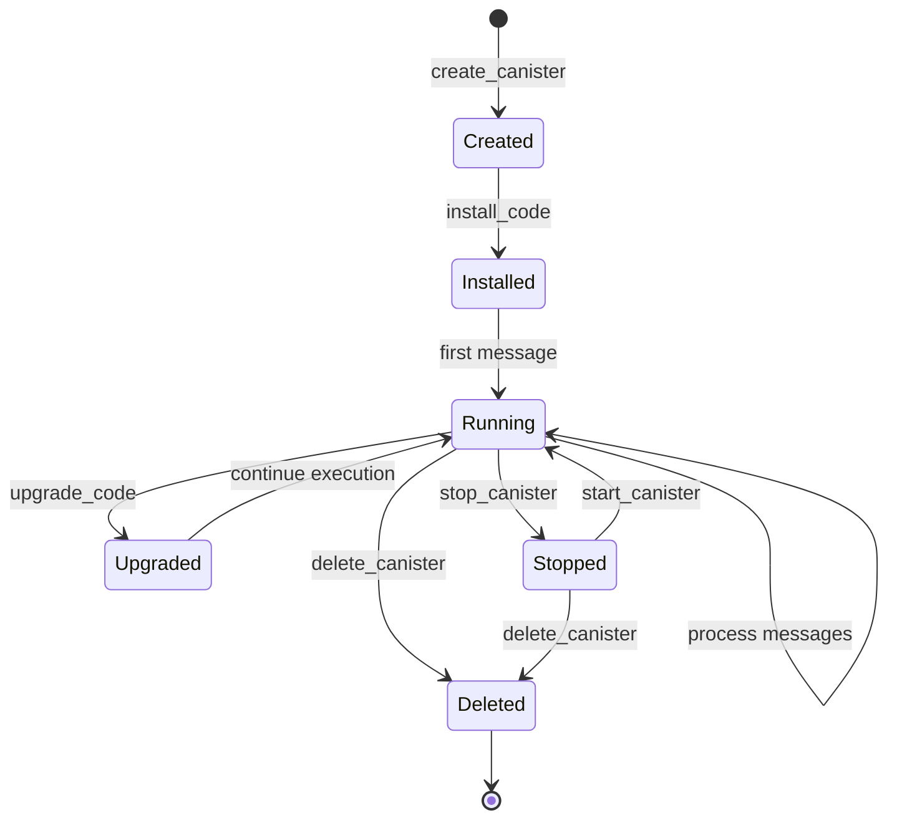

# Canisters: Evolution of Smart Contracts

Canisters are the smart contracts of the Internet Computer, but they're far more powerful than traditional blockchain smart contracts. They can serve web content, store data, process complex computations, and communicate across subnets - all while running in a fully decentralized environment.

<Info>
**What Are Canisters?**

Canisters are an evolution of smart contracts that combine:
- WebAssembly execution for language flexibility
- Persistent memory for state storage
- HTTP serving capability for web interfaces
- Autonomous execution through cycles (gas)
</Info>

## Architecture

### Process Isolation

Unlike traditional smart contract platforms where all contracts run in a single VM, ICP isolates each canister in its own process:

<Card title="Canister Sandbox" icon="shield">
**From rs/canister_sandbox/README.md:3-5**

"This implements the canister wasm sandboxing logic: All wasm execution are pulled out from the replica itself and pushed into separate processes, one per canister."
</Card>

```plaintext
Replica Process
├── Consensus Engine
├── Message Routing
├── State Manager
└── Execution Environment
    ├── Canister Sandbox Process 1 (isolated)
    ├── Canister Sandbox Process 2 (isolated)
    ├── Canister Sandbox Process 3 (isolated)
    └── ...
```

### Benefits of Process Isolation

<CardGroup cols={2}>
  <Card title="Security" icon="lock">
    OS-level process boundaries prevent canisters from interfering with each other
  </Card>
  
  <Card title="Fault Tolerance" icon="shield-check">
    A crashed canister doesn't crash the replica or other canisters
  </Card>
  
  <Card title="Resource Limits" icon="gauge">
    Each process can have CPU and memory limits enforced by the OS
  </Card>
  
  <Card title="Memory Safety" icon="shield-halved">
    WebAssembly provides memory safety within the process
  </Card>
</CardGroup>

## Canister Lifecycle

Canisters progress through several states during their lifetime:

<Steps>
  <Step title="Creation">
    **Canister Manager** creates a new canister
    
    ```rust
    // Location: rs/execution_environment/src/canister_manager.rs
    // Size: 139,612 bytes of canister management logic
    ```
    
    During creation:
    - Unique canister ID assigned
    - Initial cycles deposited
    - Controllers specified
    - Compute allocation set (optional)
  </Step>
  
  <Step title="Installation">
    WebAssembly code installed into the canister
    
    - Code must be valid WebAssembly
    - Entry points validated (init, update, query methods)
    - Initial state initialized
    - Canister becomes callable
  </Step>
  
  <Step title="Running">
    Canister processes messages and serves requests
    
    - Executes update calls (state-changing)
    - Responds to query calls (read-only)
    - Consumes cycles for computation
    - Stores data in stable memory
  </Step>
  
  <Step title="Upgrade">
    Code replaced while preserving state
    
    - New WebAssembly code deployed
    - Stable memory preserved across upgrade
    - Pre/post upgrade hooks run
    - Zero downtime
  </Step>
  
  <Step title="Deletion">
    Canister removed and resources freed
    
    - Remaining cycles returned to controller
    - All state deleted
    - Canister ID becomes invalid
  </Step>
</Steps>



## Canister Settings

Each canister has configurable settings managed by the canister manager:

```rust
// Location: rs/execution_environment/src/canister_settings.rs
```

<AccordionGroup>
  <Accordion title="Controllers">
    Principals that can manage the canister:
    - Install/upgrade code
    - Change settings
    - Delete the canister
    - Top up cycles
    
    Can have multiple controllers for governance.
  </Accordion>
  
  <Accordion title="Compute Allocation">
    Reserved computation power (0-100%):
    - 0 = best effort (default)
    - 50 = guaranteed 50% of subnet's capacity
    - Higher allocation costs more cycles
  </Accordion>
  
  <Accordion title="Memory Allocation">
    Reserved memory (bytes):
    - 0 = dynamic allocation (default)
    - >0 = guaranteed memory reservation
    - Prevents memory exhaustion
  </Accordion>
  
  <Accordion title="Freezing Threshold">
    Cycles balance that triggers freezing:
    - Prevents canister from running out of cycles
    - When balance falls below threshold, canister stops
    - Default: ~30 days of operation
  </Accordion>
</AccordionGroup>

## WebAssembly Execution

Canisters execute WebAssembly code, providing several advantages:

### Language Flexibility

<CardGroup cols={3}>
  <Card title="Rust" icon="rust">
    Primary language, used for most IC canisters
  </Card>
  
  <Card title="Motoko" icon="code">
    Purpose-built language for IC development
  </Card>
  
  <Card title="JavaScript/TypeScript" icon="js">
    Via Azle framework
  </Card>
  
  <Card title="Python" icon="python">
    Via Kybra framework
  </Card>
  
  <Card title="C/C++" icon="c">
    Direct compilation to Wasm
  </Card>
  
  <Card title="AssemblyScript" icon="code">
    TypeScript-like language
  </Card>
</CardGroup>

Any language that compiles to WebAssembly can be used to write canisters.

### Deterministic Execution

<Warning>
**Critical Requirement**

Canister execution must be **completely deterministic**:
- Same inputs always produce same outputs
- No access to system time (use IC time instead)
- No random numbers (use IC random beacon)
- No network I/O (use IC HTTPS outcalls)

This ensures all replicas reach identical state.
</Warning>

## Memory Model

Canisters have two types of memory:

### Heap Memory

<Card title="Heap (Volatile)" icon="memory">
**Characteristics**:
- Fast access
- Cleared on upgrades (unless explicitly handled)
- Limited size (typically a few GB)
- Used for runtime data structures

**Use Case**: Temporary computation, caches, runtime state
</Card>

### Stable Memory

<Card title="Stable Memory (Persistent)" icon="database">
**Characteristics**:
- Persists across upgrades
- Larger capacity (up to 400 GB)
- Slightly slower access
- Explicitly managed by developer

**Use Case**: Long-term data storage, user data, configuration
</Card>

```rust
// Example: Accessing stable memory in Rust
use ic_cdk::api::stable::{stable_read, stable_write};

// Write to stable memory
stable_write(0, &data);

// Read from stable memory  
let mut buffer = vec![0u8; size];
stable_read(0, &mut buffer);
```

## Message Types

Canisters handle different types of messages:

### Update Calls

<Card title="Update Calls" icon="pen-to-square">
**Properties**:
- Can modify state
- Go through consensus (slower)
- Signed and certified
- Charged cycles

**Example**: Transfer tokens, update profile, create post
</Card>

```rust
#[ic_cdk::update]
fn transfer(to: Principal, amount: u64) -> Result<(), String> {
    // This modifies state, so it's an update call
    // Goes through consensus
    // Result is certified
}
```

### Query Calls

<Card title="Query Calls" icon="magnifying-glass">
**Properties**:
- Read-only (cannot modify state)
- Fast (no consensus required)
- Not certified (trust the node)
- Very cheap

**Example**: Get balance, read profile, list items
</Card>

```rust
#[ic_cdk::query]
fn get_balance(account: Principal) -> u64 {
    // Read-only, no state changes
    // Fast response, no consensus
}
```

### Inter-Canister Calls

<Card title="Inter-Canister Calls" icon="arrows-left-right">
**Properties**:
- Asynchronous
- Can cross subnet boundaries
- Guaranteed delivery
- Callback-based

**Example**: Call another canister's method
</Card>

```rust
#[ic_cdk::update]
async fn composite_operation() -> Result<(), String> {
    // Call another canister
    let result: (u64,) = ic_cdk::call(
        other_canister_id,
        "get_data",
        ()
    ).await.map_err(|e| format!("{:?}", e))?;
    
    Ok(())
}
```

## Cycles: The Economic Model

Canisters use **cycles** (not ICP tokens directly) to pay for resources:

### What Cycles Pay For

<CardGroup cols={2}>
  <Card title="Computation" icon="microchip">
    WebAssembly instruction execution
  </Card>
  
  <Card title="Storage" icon="hard-drive">
    Memory usage over time (per GB per second)
  </Card>
  
  <Card title="Network" icon="network-wired">
    Inter-canister and HTTP outcalls
  </Card>
  
  <Card title="Special Operations" icon="star">
    HTTPS requests, threshold ECDSA signatures, etc.
  </Card>
</CardGroup>

### Cycles Accounting

```rust
// Location: rs/cycles_account_manager/
```

The cycles account manager tracks:
- Current balance
- Consumption rate
- Freezing threshold
- Resource limits

<Tip>
**Reverse Gas Model**

Unlike Ethereum where users pay gas, on ICP the **canister pays cycles**. This enables better UX - users don't need tokens to interact with dapps.
</Tip>

## Canister Logs

Canisters can emit logs for debugging:

```rust
// Location: rs/execution_environment/src/canister_logs.rs
```

```rust
#[ic_cdk::update]
fn debug_operation() {
    ic_cdk::println!("Debug: operation started");
    // ... operation logic
    ic_cdk::println!("Debug: operation completed");
}
```

Logs are:
- Visible to controllers
- Not part of consensus (don't affect state)
- Useful for debugging and monitoring

## HTTP Serving

Canisters can serve HTTP requests directly:

```rust
#[ic_cdk::query]
fn http_request(req: HttpRequest) -> HttpResponse {
    HttpResponse {
        status_code: 200,
        headers: vec![("Content-Type".to_string(), "text/html".to_string())],
        body: b"<html><body>Hello from canister!</body></html>".to_vec(),
    }
}
```

<Info>
This allows canisters to serve entire web applications directly to browsers, with no traditional servers required.
</Info>

## Security Features

### Sandboxing

Multiple layers of security:

<Steps>
  <Step title="WebAssembly">
    Memory-safe execution, no direct system access
  </Step>
  
  <Step title="Process Isolation">
    Separate OS process per canister
  </Step>
  
  <Step title="Resource Limits">
    CPU time, memory, instruction count limits
  </Step>
  
  <Step title="Capability-Based">
    Explicit permissions for inter-canister calls
  </Step>
</Steps>

### Canister Signatures

Canisters can create cryptographic signatures:

```rust
// Canister can sign messages using threshold ECDSA
// Useful for controlling assets on other blockchains
let signature = ic_cdk::api::management_canister::ecdsa::
    sign_with_ecdsa(args).await?;
```

This enables:
- Bitcoin integration (canisters holding BTC)
- Ethereum integration (canisters controlling ETH)
- Cross-chain DeFi

## Advanced Features

### Timers

```rust
use ic_cdk_timers::set_timer_interval;

// Schedule periodic execution
set_timer_interval(Duration::from_secs(60), || {
    // This runs every 60 seconds
    periodic_task();
});
```

### Certified Data

```rust
use ic_cdk::api::set_certified_data;

// Set certified data that can be verified by clients
set_certified_data(&hash);
```

Clients can verify this data using the subnet's public key.

### Threshold ECDSA

```rust
// Request threshold ECDSA signature
let args = SignWithECDSAArgs {
    message_hash,
    derivation_path,
    key_id,
};

let (response,): (SignWithECDSAResponse,) = 
    ic_cdk::call(mgmt_canister_id, "sign_with_ecdsa", (args,))
    .await?;
```

Enables secure integration with other blockchains.

## Best Practices

<AccordionGroup>
  <Accordion title="Use Stable Memory for Important Data">
    Always store user data and critical state in stable memory:
    
    ```rust
    #[pre_upgrade]
    fn pre_upgrade() {
        // Save state to stable memory before upgrade
        stable_save((STATE.with(|s| s.borrow().clone()),)).unwrap();
    }
    
    #[post_upgrade]  
    fn post_upgrade() {
        // Restore state from stable memory after upgrade
        let (old_state,): (State,) = stable_restore().unwrap();
        STATE.with(|s| *s.borrow_mut() = old_state);
    }
    ```
  </Accordion>
  
  <Accordion title="Monitor Cycles Balance">
    Prevent canister from running out of cycles:
    
    ```rust
    fn check_cycles() {
        let balance = ic_cdk::api::canister_balance();
        if balance < MINIMUM_CYCLES {
            ic_cdk::trap("Low cycles!");
        }
    }
    ```
  </Accordion>
  
  <Accordion title="Use Guards for Access Control">
    Implement proper authorization:
    
    ```rust
    fn is_controller() -> Result<(), String> {
        let caller = ic_cdk::caller();
        if !CONTROLLERS.contains(&caller) {
            return Err("Not authorized".to_string());
        }
        Ok(())
    }
    ```
  </Accordion>
  
  <Accordion title="Handle Async Errors">
    Always handle inter-canister call errors:
    
    ```rust
    let result: Result<(ReturnType,), _> = 
        ic_cdk::call(canister_id, method, args).await;
    
    match result {
        Ok((data,)) => // handle success,
        Err((code, msg)) => // handle error,
    }
    ```
  </Accordion>
</AccordionGroup>

## Next Steps

<CardGroup cols={2}>
  <Card title="Architecture" icon="sitemap" href="/concepts/architecture">
    See how canisters fit into the overall system
  </Card>
  
  <Card title="Consensus" icon="handshake" href="/concepts/consensus">
    Understand how canister messages are ordered
  </Card>
  
  <Card title="Build a Canister" icon="hammer" href="https://sdk.dfinity.org/docs/quickstart/quickstart-intro.html">
    Start building with the Canister SDK
  </Card>
  
  <Card title="Network Nervous System" icon="brain" href="/concepts/network-nervous-system">
    Learn about NNS canisters that govern ICP
  </Card>
</CardGroup>

## Further Reading

<Card title="External Resources" icon="book-open">
- [Software Canisters: An Evolution of Smart Contracts](https://medium.com/dfinity/software-canisters-an-evolution-of-smart-contracts-internet-computer-f1f92f1bfffb)
- [Canister SDK Documentation](https://sdk.dfinity.org/)
- Execution environment source: `rs/execution_environment/` in the repository
- Canister sandbox source: `rs/canister_sandbox/` in the repository
</Card>