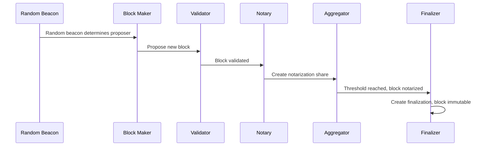

# Consensus Protocol

The Internet Computer consensus protocol is a sophisticated Byzantine Fault Tolerant (BFT) algorithm that enables nodes to agree on the state of the blockchain at near web speed. Unlike traditional blockchain consensus (Proof of Work, traditional BFT), ICP's consensus is optimized for speed, finality, and unpredictability.

<Info>
**From the Consensus Module** (rs/consensus/src/lib.rs:2-6)

"The consensus crate provides implementations of the consensus algorithm of the internet computer block chain, a component responsible for executing distributed key generation using said block chain to hold the state of the algorithm, and a component responsible for certifying state hashes produced by the upper layers of the internet computer."
</Info>

## Overview

The Internet Computer consensus protocol achieves:

<CardGroup cols={2}>
  <Card title="Fast Finality" icon="bolt">
    Blocks are finalized in seconds, not minutes or hours
  </Card>
  
  <Card title="High Throughput" icon="gauge-high">
    Processes thousands of messages per second per subnet
  </Card>
  
  <Card title="Byzantine Tolerance" icon="shield">
    Tolerates up to 1/3 malicious nodes
  </Card>
  
  <Card title="Unpredictable Leader Selection" icon="dice">
    Random beacon ensures no one can predict or manipulate block makers
  </Card>
</CardGroup>

## Consensus Architecture

### The Nine Subcomponents

The consensus implementation consists of nine coordinated subcomponents working in harmony:

```rust
// From rs/consensus/src/consensus.rs:130-140
pub struct ConsensusImpl {
    notary: Notary,
    finalizer: Finalizer,
    random_beacon_maker: RandomBeaconMaker,
    random_tape_maker: RandomTapeMaker,
    block_maker: BlockMaker,
    catch_up_package_maker: CatchUpPackageMaker,
    validator: Validator,
    aggregator: ShareAggregator,
    purger: Purger,
    metrics: ConsensusMetrics,
    // ... additional fields
}
```

<Tip>
**Round-Robin Execution**

These subcomponents are invoked in a round-robin manner, ensuring each gets a fair chance to progress the protocol.
</Tip>

## The Consensus Flow

Here's how a block progresses through the consensus pipeline:

<Steps>
  <Step title="Random Beacon Generation">
    **Random Beacon Maker** creates unpredictable randomness
    
    - Uses threshold cryptography
    - Each node contributes a signature share
    - Shares are aggregated into a beacon
    - Beacon determines who can propose blocks
    
    ```rust
    // Subcomponent: RandomBeaconMaker
    // Location: rs/consensus/src/consensus/random_beacon_maker.rs
    ```
  </Step>
  
  <Step title="Block Proposal">
    **Block Maker** proposes a new block (if selected)
    
    - Random beacon determines eligible proposers
    - Block maker creates block with payload
    - Payload includes canister messages, XNet messages, etc.
    - Block references parent block creating a chain
    
    ```rust
    // Subcomponent: BlockMaker  
    // Location: rs/consensus/src/consensus/block_maker.rs
    ```
  </Step>
  
  <Step title="Validation">
    **Validator** checks the proposed block
    
    - Verifies cryptographic signatures
    - Checks block maker was eligible
    - Validates payload correctness
    - Ensures block extends valid chain
    
    ```rust
    // Subcomponent: Validator
    // Location: rs/consensus/src/consensus/validator.rs
    ```
  </Step>
  
  <Step title="Notarization">
    **Notary** creates threshold signature shares
    
    - Each node creates a notarization share for valid blocks
    - Shares are broadcast to all nodes
    - No single node can notarize alone (Byzantine tolerance)
    
    ```rust
    // Subcomponent: Notary
    // Location: rs/consensus/src/consensus/notary.rs
    ```
  </Step>
  
  <Step title="Share Aggregation">
    **Aggregator** combines signature shares
    
    - Collects notarization shares from nodes
    - When threshold reached, creates full notarization
    - Notarized block is considered valid by subnet
    
    ```rust
    // Subcomponent: ShareAggregator
    // Location: rs/consensus/src/consensus/share_aggregator.rs
    ```
  </Step>
  
  <Step title="Finalization">
    **Finalizer** marks blocks as immutable
    
    - Creates finalization shares for notarized blocks
    - Once finalized, block cannot be reverted
    - State transitions become permanent
    
    ```rust
    // Subcomponent: Finalizer
    // Location: rs/consensus/src/consensus/finalizer.rs
    ```
  </Step>
</Steps>



## Random Beacon: The Heart of Unpredictability

The random beacon is what makes ICP consensus secure and unpredictable:

### How It Works

<AccordionGroup>
  <Accordion title="Threshold Signatures">
    - Uses BLS threshold signatures on the BLS12-381 curve
    - Each node holds a share of the subnet's private key
    - No single node knows the full key
    - Threshold of nodes (>2/3) needed to sign
  </Accordion>
  
  <Accordion title="Beacon Construction">
    - Each round, nodes create signature shares of the previous beacon
    - Shares are aggregated into a new random beacon
    - Result is unpredictable even if < 1/3 nodes are malicious
    - Beacon output determines block proposer priority
  </Accordion>
  
  <Accordion title="Verifiable Randomness">
    - Anyone can verify the beacon is correctly generated
    - No one can predict future beacons (not even nodes)
    - Provides fair, unbiased block maker selection
  </Accordion>
</AccordionGroup>

### Random Tape

In addition to the beacon, there's a **random tape** for canister use:

```rust
// Subcomponent: RandomTapeMaker
// Provides randomness for canister execution
```

This allows canisters to access secure randomness without being able to manipulate it.

## Catch-Up Packages (CUPs)

Catch-Up Packages enable new or slow nodes to quickly sync with the subnet:

### Purpose

- **Fast Sync**: New nodes don't need to replay all blocks from genesis
- **Checkpoint**: Contains certified state at a specific height
- **Recovery**: Helps nodes recover from crashes or disconnections

### CUP Contents

```rust
// Subcomponent: CatchUpPackageMaker
// Location: rs/consensus/src/consensus/catchup_package_maker.rs
```

A CUP includes:
- State hash at a specific height
- Threshold signature over the state
- Registry version and configuration
- Block chain to continue from

## Bounding the Consensus Pool

To prevent unbounded memory growth, the protocol enforces strict bounds:

```rust
// From rs/consensus/src/consensus.rs:70-82

/// In order to have a bound on the advertised consensus pool, we place a limit on
/// the notarization/certification gap.
pub(crate) const ACCEPTABLE_NOTARIZATION_CERTIFICATION_GAP: u64 = 70;

/// In order to have a bound on the advertised consensus pool, we place a limit on
/// the gap between notarized height and the height of the next pending CUP.
pub(crate) const ACCEPTABLE_NOTARIZATION_CUP_GAP: u64 = 130;
```

<Warning>
**Why These Bounds Matter**

Without bounds:
- Consensus pool could grow indefinitely
- Nodes could run out of memory
- Network bandwidth would be overwhelmed with artifact advertisements

The gaps ensure nodes stay reasonably synchronized.
</Warning>

### The Purger

```rust
// Subcomponent: Purger  
// Location: rs/consensus/src/consensus/purger.rs
```

The purger removes old consensus artifacts that are no longer needed:
- Blocks below the finalized height
- Old notarizations and finalizations
- Obsolete signature shares

## Payload Building

Blocks contain payloads - the actual work to be done:

### Payload Types

<CardGroup cols={2}>
  <Card title="Ingress Messages" icon="inbox">
    User requests to canisters (from external users)
  </Card>
  
  <Card title="XNet Messages" icon="network-wired">
    Cross-subnet canister-to-canister calls
  </Card>
  
  <Card title="Self-Validating" icon="check-circle">
    Bitcoin, HTTPS outcalls, and other external integrations
  </Card>
  
  <Card title="Consensus" icon="handshake">
    Protocol-level operations (DKG, subnet management)
  </Card>
</CardGroup>

### Parallel Payload Construction

```rust
// From rs/consensus/src/consensus.rs:85
pub const MAX_CONSENSUS_THREADS: usize = 16;
```

Payload creation and validation happen in parallel using up to 16 threads:

```rust
// From rs/consensus/src/consensus.rs:119-126
pub fn build_thread_pool(num_threads: usize) -> Arc<ThreadPool> {
    Arc::new(
        ThreadPoolBuilder::new()
            .num_threads(num_threads)
            .build()
            .expect("Failed to create thread pool"),
    )
}
```

This parallelism is crucial for achieving high throughput.

## Testing Consensus

The codebase includes a sophisticated consensus test framework:

### Running Consensus Tests

```bash
# Basic multi-node consensus test
RUST_LOG=Debug cargo test --test integration multiple_nodes_are_live -- --nocapture
```

### Configurable Parameters

From `rs/consensus/README.adoc:29-37`:

<AccordionGroup>
  <Accordion title="RANDOM_SEED">
    Seed for all randomness, or `Random` for unpredictable seed
    
    ```bash
    RANDOM_SEED=12345 cargo test --test integration ...
    ```
  </Accordion>
  
  <Accordion title="NUM_NODES">
    Number of nodes in the simulation (default: 10)
    
    ```bash
    NUM_NODES=6 cargo test --test integration ...
    ```
  </Accordion>
  
  <Accordion title="NUM_ROUNDS">
    Number of consensus rounds to run
    
    ```bash
    NUM_ROUNDS=100 cargo test --test integration ...
    ```
  </Accordion>
  
  <Accordion title="MAX_DELTA">
    Maximum network latency in milliseconds (default: 1000)
    
    ```bash
    MAX_DELTA=500 cargo test --test integration ...
    ```
  </Accordion>
</AccordionGroup>

### Example: Custom Test Configuration

```bash
# Run 6-node network for 100 rounds with detailed logging
NUM_NODES=6 NUM_ROUNDS=100 RUST_LOG=Debug \
  cargo test --test integration multiple_nodes_are_live -- --nocapture
```

### Stress Testing

From the README, here's how to continuously test consensus:

```bash
# Run until failure with random parameters
while true; do \
  RUST_LOG=Info,ic_consensus::finalizer=Debug \
  NUM_NODES=Random RANDOM_SEED=Random \
  cargo test --test integration multiple_nodes_are_live -- --nocapture \
    || break; \
done
```

This will keep testing with different random configurations until a failure occurs.

## Byzantine Fault Tolerance

### Threat Model

The protocol tolerates:
- **Crash failures**: Nodes going offline
- **Network partitions**: Temporary loss of connectivity  
- **Byzantine nodes**: Up to f < n/3 malicious nodes

### Security Properties

<CardGroup cols={2}>
  <Card title="Safety" icon="shield-halved">
    Honest nodes never finalize conflicting blocks (even if 1/3 are malicious)
  </Card>
  
  <Card title="Liveness" icon="heart-pulse">
    Protocol makes progress as long as >2/3 nodes are honest and connected
  </Card>
  
  <Card title="Unpredictability" icon="shuffle">
    No one can predict future block makers (prevents manipulation)
  </Card>
  
  <Card title="Finality" icon="flag-checkered">
    Finalized blocks are permanently immutable (no reorgs)
  </Card>
</CardGroup>

### Threshold Cryptography

The protocol's security relies on threshold signatures:

- **t-of-n threshold**: Need >2/3 of nodes to create valid signatures
- **BLS12-381**: Efficient pairing-based cryptography
- **Share aggregation**: Individual shares combine into full signature
- **Uniqueness**: For a given message, only one valid threshold signature exists

## Version Compatibility

The protocol checks that all nodes run compatible versions:

```rust
// From rs/consensus/src/consensus.rs:107-116
pub(crate) fn check_protocol_version(
    version: &ReplicaVersion,
) -> Result<(), ReplicaVersionMismatch> {
    let expected_version = ReplicaVersion::default();
    if version != &expected_version {
        Err(ReplicaVersionMismatch {})
    } else {
        Ok(())
    }
}
```

<Info>
This ensures all nodes execute the same consensus logic, critical for deterministic agreement.
</Info>

## Performance Characteristics

### Latency

- **Block proposal**: ~1-2 seconds
- **Notarization**: ~1 second  
- **Finalization**: ~1 second
- **Total finality**: ~2-4 seconds

These are typical values; actual performance depends on network conditions and subnet size.

### Throughput

- Thousands of transactions per second per subnet
- Scales horizontally by adding more subnets
- Each subnet operates independently in parallel

## Consensus Artifacts

The protocol operates on several types of artifacts:

<AccordionGroup>
  <Accordion title="Blocks">
    - Proposed by block makers
    - Contain payload to execute
    - Reference parent blocks
    - Include random beacon and tape
  </Accordion>
  
  <Accordion title="Notarizations">
    - Threshold signatures over blocks
    - Indicate subnet validated the block
    - Required before finalization
  </Accordion>
  
  <Accordion title="Finalizations">
    - Threshold signatures over notarized blocks
    - Make blocks immutable
    - Trigger state transitions
  </Accordion>
  
  <Accordion title="Random Beacons">
    - Threshold signatures providing randomness
    - One per height
    - Determines block maker selection
  </Accordion>
  
  <Accordion title="Random Tapes">
    - Additional randomness for execution
    - Used by canisters
    - Cannot be manipulated
  </Accordion>
  
  <Accordion title="Catch-Up Packages">
    - Checkpoints with certified state
    - Enable fast synchronization
    - Created periodically
  </Accordion>
</AccordionGroup>

## Next Steps

<CardGroup cols={2}>
  <Card title="Architecture" icon="sitemap" href="/concepts/architecture">
    Understand how consensus fits into the overall architecture
  </Card>
  
  <Card title="Canisters" icon="cube" href="/concepts/canisters">
    Learn about the smart contracts that execute on finalized blocks
  </Card>
  
  <Card title="Network Nervous System" icon="brain" href="/concepts/network-nervous-system">
    Explore how the protocol itself is governed
  </Card>
  
  <Card title="Quickstart" icon="code" href="/quickstart">
    Build and test the consensus code yourself
  </Card>
</CardGroup>

## Further Reading

<Card title="External Resources" icon="book-open">
- [Achieving Consensus on the Internet Computer](https://medium.com/dfinity/achieving-consensus-on-the-internet-computer-ee9fbfbafcbc) - High-level protocol overview
- [IC Interface Specification](https://sdk.dfinity.org/docs/interface-spec/index.html) - Formal protocol specification  
- Consensus source code: `rs/consensus/` in the repository
</Card>