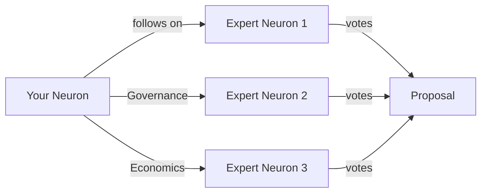
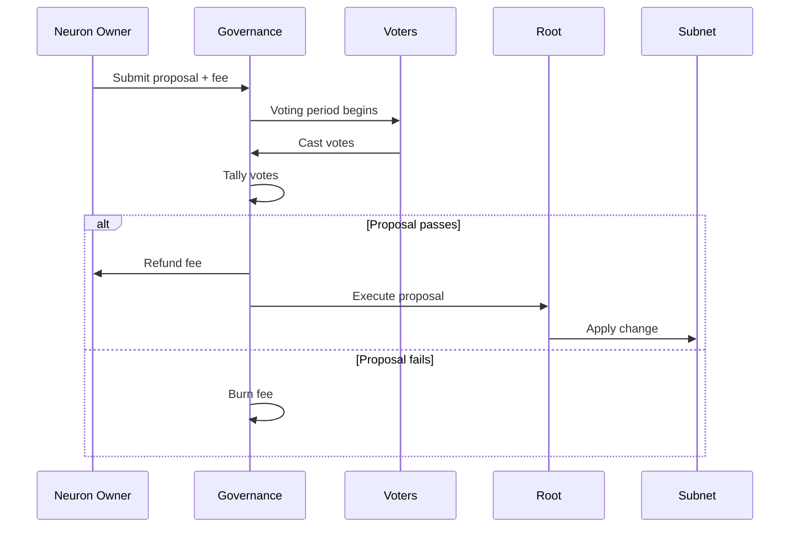
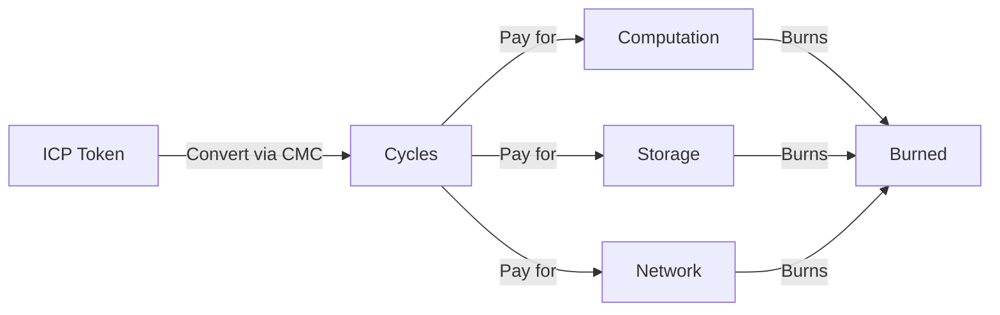

# Network Nervous System (NNS)

The Network Nervous System (NNS) is the decentralized autonomous organization (DAO) that governs the entire Internet Computer. It's not just a governance layer - it's a fully on-chain, algorithmic system that controls every aspect of the network.

<Info>
**From rs/nns/README.adoc:1-3**

"This directory is intended to contain the various canisters, and possibly command-line tools, used for decentralized control of the Internet Computer."
</Info>

## What the NNS Controls

The NNS has complete control over the Internet Computer's operation:

<CardGroup cols={2}>
  <Card title="Network Topology" icon="network-wired">
    Adding/removing nodes, creating subnets, modifying subnet membership
  </Card>
  
  <Card title="Protocol Upgrades" icon="arrow-up">
    Upgrading replica software, changing protocol parameters
  </Card>
  
  <Card title="Node Economics" icon="coins">
    Node provider rewards, cycle pricing, transaction fees
  </Card>
  
  <Card title="Canister Management" icon="cube">
    Creating NNS canisters, upgrading system canisters
  </Card>
  
  <Card title="ICP Token" icon="circle-dollar">
    Token supply, neuron staking, voting rewards
  </Card>
  
  <Card title="Registry" icon="book">
    Network configuration, cryptographic keys, subnet records
  </Card>
</CardGroup>

<Warning>
**Fully On-Chain Governance**

Unlike many blockchain governance systems that use off-chain voting or multi-sig, the NNS is **completely on-chain**. Approved proposals execute automatically without any human intervention.
</Warning>

## NNS Architecture

### The NNS Subnet

The NNS runs on a special subnet called the **NNS subnet**:

- Highest replication factor (more nodes than regular subnets)
- Strictest node requirements
- Geographically distributed
- Contains all NNS canisters

```plaintext
Internet Computer
├── NNS Subnet (governance)
│   ├── Governance Canister
│   ├── Registry Canister  
│   ├── Ledger Canister
│   ├── Cycles Minting Canister
│   ├── Root Canister
│   ├── Lifeline Canister
│   └── SNS-WASM Canister
├── Application Subnet 1
├── Application Subnet 2
└── Application Subnet N
```

### Core NNS Canisters

<AccordionGroup>
  <Accordion title="Governance Canister" icon="building-columns">
    **Location**: `rs/nns/governance/`
    
    The heart of the NNS:
    - Manages proposals and voting
    - Tracks neurons (staked ICP)
    - Calculates voting rewards
    - Executes approved proposals
    
    **Canister ID**: `rrkah-fqaaa-aaaaa-aaaaq-cai`
    
    ```bash
    # Interact via Candid UI
    # http://localhost:8081/candid?canisterId=rrkah-fqaaa-aaaaa-aaaaq-cai
    ```
  </Accordion>
  
  <Accordion title="Registry Canister" icon="book">
    **Location**: `rs/registry/canister/`
    
    Stores all network configuration:
    - Subnet membership and topology
    - Node operator information
    - Cryptographic public keys
    - Protocol versions
    - Routing tables
    
    Updated only through NNS proposals.
  </Accordion>
  
  <Accordion title="Ledger Canister" icon="book-open">
    **Location**: `rs/ledger_suite/icp/ledger/`
    
    The ICP token ledger:
    - Tracks all ICP balances
    - Processes transfers
    - Records transactions
    - ICRC-1 compatible
    
    This is the "central bank" of the Internet Computer.
  </Accordion>
  
  <Accordion title="Cycles Minting Canister" icon="industry">
    **Location**: `rs/nns/cmc/`
    
    Converts ICP to cycles:
    - Accepts ICP tokens
    - Burns ICP
    - Mints cycles at current exchange rate
    - Manages node provider payments
    
    Cycles are used to pay for computation on the IC.
  </Accordion>
  
  <Accordion title="Root Canister" icon="crown">
    **Location**: `rs/nns/handlers/root/impl/`
    
    Orchestrates upgrades:
    - Upgrades NNS canisters
    - Upgrades subnet replicas
    - Executes topology changes
    
    **Canister ID**: `r7inp-6aaaa-aaaaa-aaabq-cai`
    
    Only executes proposals approved by governance.
  </Accordion>
  
  <Accordion title="Lifeline Canister" icon="heart-pulse">
    **Location**: `rs/nns/handlers/lifeline/impl/`
    
    Emergency recovery mechanism:
    - Can upgrade governance if it becomes non-functional
    - Last resort recovery tool
    - Rarely used, high threshold for activation
    
    **Canister ID**: `rkp4c-7iaaa-aaaaa-aaaca-cai`
  </Accordion>
  
  <Accordion title="SNS-WASM Canister" icon="box">
    **Location**: `rs/nns/sns-wasm/`
    
    Manages Service Nervous System deployments:
    - Stores SNS canister WebAssembly
    - Deploys new SNS instances
    - Handles SNS upgrades
    
    SNS allows individual dapps to have their own governance.
  </Accordion>
</AccordionGroup>

## Neurons: The Voting Units

### What is a Neuron?

A neuron is ICP tokens locked for governance participation:

```rust
// Neurons are managed in the Governance canister
// Location: rs/nns/governance/
```

<Steps>
  <Step title="Create Neuron">
    Lock ICP tokens for a minimum dissolve delay
    
    ```bash
    # Minimum: 6 months
    # Maximum: 8 years
    # Longer lock = more voting power
    ```
  </Step>
  
  <Step title="Vote on Proposals">
    Use your neuron to vote on NNS proposals
    
    - Manual voting
    - Or configure "following" (liquid democracy)
  </Step>
  
  <Step title="Earn Rewards">
    Receive voting rewards in ICP
    
    - Rewards based on voting participation
    - Higher for longer dissolve delays
    - Compounds over time (maturity)
  </Step>
  
  <Step title="Dissolve and Retrieve">
    After dissolve delay, unlock your ICP
    
    - Start dissolving
    - Wait for dissolve delay to pass
    - Disburse ICP to your account
  </Step>
</Steps>

### Neuron Properties

<CardGroup cols={2}>
  <Card title="Dissolve Delay" icon="clock">
    How long tokens are locked (6 months to 8 years)
  </Card>
  
  <Card title="Age" icon="calendar">
    How long the neuron has existed without dissolving
  </Card>
  
  <Card title="Voting Power" icon="scale-balanced">
    Stake × DissolveDelay bonus × Age bonus
  </Card>
  
  <Card title="Maturity" icon="seedling">
    Accumulated voting rewards (can be staked or minted)
  </Card>
</CardGroup>

### Following (Liquid Democracy)

Neurons can follow other neurons on specific topics:



<Tip>
**Liquid Democracy Benefits**:
- Don't need to vote on every proposal
- Delegate expertise to specialists
- Can override following votes manually
- Still earn voting rewards
</Tip>

## Proposal Types

The NNS handles many types of proposals:

<AccordionGroup>
  <Accordion title="Network Topology" icon="sitemap">
    **Examples**:
    - Create new subnet
    - Add node to subnet
    - Remove node from subnet
    - Update subnet configuration
    
    **Impact**: Changes network structure
  </Accordion>
  
  <Accordion title="Protocol Upgrades" icon="arrow-up">
    **Examples**:
    - Upgrade replica binary version
    - Update protocol parameters
    - Bless new replica version
    - Retire old replica version
    
    **Impact**: Changes how nodes operate
  </Accordion>
  
  <Accordion title="Node Provider Rewards" icon="coins">
    **Examples**:
    - Set node provider monthly rewards
    - Update reward coefficients
    - Adjust for data center location
    
    **Impact**: Economics of running nodes
  </Accordion>
  
  <Accordion title="Canister Management" icon="cube">
    **Examples**:
    - Upgrade NNS canister
    - Create system canister
    - Change canister settings
    
    **Impact**: NNS functionality
  </Accordion>
  
  <Accordion title="Governance Parameters" icon="sliders">
    **Examples**:
    - Change proposal rejection fee
    - Update voting reward parameters
    - Modify neuron minimum stake
    
    **Impact**: How governance works
  </Accordion>
  
  <Accordion title="Exchange Rate" icon="chart-line">
    **Examples**:
    - Update ICP/XDR exchange rate
    - Modify cycles price
    
    **Impact**: Cost of computation
  </Accordion>
  
  <Accordion title="Motion Proposals" icon="comment">
    **Examples**:
    - General discussions
    - Future feature requests
    - Community initiatives
    
    **Impact**: Non-binding, signals intent
  </Accordion>
</AccordionGroup>

## Proposal Lifecycle

<Steps>
  <Step title="Submission">
    Anyone with a neuron (meeting minimum stake) can submit a proposal
    
    - Requires rejection fee deposit
    - Fee returned if proposal passes
    - Fee burned if proposal fails
  </Step>
  
  <Step title="Voting Period">
    Neurons vote over a fixed period
    
    - Typically 48 hours for most proposals
    - Shorter for time-sensitive proposals
    - Vote: Yes, No, or Abstain
  </Step>
  
  <Step title="Decision">
    Proposal decided based on voting power
    
    - Requires majority of voting power
    - Different thresholds for different proposal types
    - Critical proposals need supermajority
  </Step>
  
  <Step title="Execution">
    Approved proposals execute automatically
    
    - No human intervention
    - Governance calls Root canister
    - Root orchestrates the change
    - Update reflected across network
  </Step>
</Steps>



## Interacting with the NNS

### Via dfx (Command Line)

From `rs/nns/README.adoc:74-84`:

```bash
# Get neuron info
dfx canister call neurons get_neuron_info --type=idl '( 449479075714955186 )'

# Vote on proposal
dfx canister call neurons forward_vote --type=idl '( 449479075714955186, 1, variant{Yes} )'

# Get proposal info
dfx canister call neurons get_proposal_info --type=idl '( 1 )'
```

### Via ic-admin Tool

```bash
# Get blessed replica versions
cargo run --bin ic-admin -- \
  --nns-url=http://localhost:8080 \
  get-blessed-replica-versions

# Get subnet list
cargo run --bin ic-admin -- \
  --nns-url=http://localhost:8080 \
  get-subnet-list
```

### Via Candid Web UI

From `rs/nns/README.adoc:55-66`:

<CodeGroup>
```bash Start Web Server
# For local replica
dfx bootstrap

# For testnet
dfx bootstrap --network=nnstestnet
```

```plaintext Access UIs
Governance: http://localhost:8081/candid?canisterId=rrkah-fqaaa-aaaaa-aaaaq-cai
Root:       http://localhost:8081/candid?canisterId=r7inp-6aaaa-aaaaa-aaabq-cai  
Lifeline:   http://localhost:8081/candid?canisterId=rkp4c-7iaaa-aaaaa-aaaca-cai
```
</CodeGroup>

## Deploying NNS Locally

For development and testing:

<Steps>
  <Step title="Start Local Replica">
    ```bash
    cd rs/nns
    dfx start --host 127.0.0.1:8080
    ```
  </Step>
  
  <Step title="Build NNS Canisters">
    ```bash
    # Build all NNS canisters
    cargo build -p registry-canister
    cargo build -p governance-canister
    # ... other canisters
    ```
  </Step>
  
  <Step title="Deploy NNS">
    ```bash
    cd rs/
    cargo run --bin ic-nns-init -- \
      --url http://localhost:8080/ \
      --wasm-dir=./target/wasm32-unknown-unknown/release
    ```
  </Step>
</Steps>

<Tip>
Run `cargo run --bin ic-nns-init -- --help` for all available options.
</Tip>

## The Registry: Network Configuration

The Registry canister is critical infrastructure:

### What's in the Registry?

```rust
// Location: rs/registry/
```

<CardGroup cols={2}>
  <Card title="Node Records" icon="server">
    Every node's ID, operator, data center, public keys
  </Card>
  
  <Card title="Subnet Records" icon="network-wired">
    Subnet membership, replica version, parameters
  </Card>
  
  <Card title="Routing Tables" icon="route">
    Which canisters are hosted on which subnets
  </Card>
  
  <Card title="Crypto Keys" icon="key">
    Threshold signature public keys, DKG transcripts
  </Card>
</CardGroup>

### Registry Versions

The registry is versioned:
- Each change creates a new version
- Old versions remain available
- Nodes sync to latest version
- Proposals specify target version

```bash
# Get current registry version
cargo run --bin ic-admin -- \
  --nns-url=http://localhost:8080 \
  get-registry-version
```

## Token Economics

### ICP Token

The ICP utility token has several uses:

<AccordionGroup>
  <Accordion title="Governance">
    Stake in neurons to participate in governance and earn rewards
  </Accordion>
  
  <Accordion title="Cycles Creation">
    Convert to cycles to pay for computation and storage
  </Accordion>
  
  <Accordion title="Node Provider Rewards">
    Nodes are paid in ICP for providing infrastructure
  </Accordion>
  
  <Accordion title="Value Transfer">
    Transfer between accounts like any cryptocurrency
  </Accordion>
</AccordionGroup>

### Cycles: Stable Compute Units

Cycles are the "gas" of the Internet Computer:

- **Stable value**: 1 trillion cycles ≈ 1 XDR (SDR)
- **ICP/XDR rate**: Updated regularly via NNS proposal
- **Burn mechanism**: Cycles are burned when used
- **Deflationary**: Using IC reduces cycle supply



## Security & Upgrades

### Upgrade Safety

<Warning>
**Critical System**

The NNS controls the entire Internet Computer. Upgrading NNS canisters requires extreme care:

- Proposals need high voting thresholds
- Code is reviewed extensively
- Testing in staging environments
- Gradual rollout when possible
</Warning>

### The Lifeline Canister

Emergency recovery if governance breaks:

```rust
// Location: rs/nns/handlers/lifeline/impl/
```

Only used if:
- Governance canister becomes non-functional
- Requires exceptional circumstances
- Very high threshold to activate
- Last resort mechanism

## Proposal Examples

### Creating a Subnet

From `rs/nns/README.adoc:94-120`:

```bash
# 1. Generate node key material
cargo run --bin ic-prep --release -- \
  --working-dir /tmp/replicas \
  --replica-version 0.8.0 \
  --node idx:1,subnet_idx:1,xnet_api:"[::1]:2497",public_api:"[::1]:8080" \
  --node idx:2,subnet_idx:1,xnet_api:"[::1]:2497",public_api:"[::1]:8080" \
  --node idx:3,subnet_idx:1,xnet_api:"[::1]:2497",public_api:"[::1]:8080"

# 2. Upload key material to registry
cargo run --bin ic-admin -- \
  --registry-url http://localhost:8080 \
  add-all-pb-files-in-path /tmp/replicas/node-1

# 3. Create the proposal
cargo run --bin ic-admin -- \
  --nns-url http://localhost:8080 \
  propose-to-create-subnet \
  --summary "Creating subnet" \
  --subnet-handler <handler-id> \
  <node-id-1> <node-id-2> <node-id-3>
```

### Blessing a Replica Version

```bash
cargo run --bin ic-admin -- \
  --nns-url=http://localhost:8080 \
  propose-to-bless-replica-version \
  --replica-version-id <version-hash> \
  --summary "Bless new replica version"
```

## Monitoring the NNS

### View Proposals

All NNS proposals are public:
- [NNS Proposals Repository](https://github.com/dfinity/nns-proposals)
- [IC Dashboard - Governance](https://dashboard.internetcomputer.org/governance)

### Metrics

```bash
# View governance metrics
curl http://<nns-node>:9090/metrics | grep governance
```

## Best Practices

<AccordionGroup>
  <Accordion title="For Neuron Holders">
    - Participate in voting (directly or via following)
    - Diversify followees across topics
    - Review important proposals before voting
    - Consider long dissolve delays for maximum rewards
  </Accordion>
  
  <Accordion title="For Proposal Submitters">
    - Write clear, detailed proposal summaries
    - Discuss in forum before submitting
    - Be prepared to answer questions
    - Ensure proposal is technically feasible
  </Accordion>
  
  <Accordion title="For Node Providers">
    - Monitor registry for configuration updates
    - Keep nodes updated with blessed versions
    - Respond quickly to subnet changes
    - Maintain high availability
  </Accordion>
</AccordionGroup>

## Next Steps

<CardGroup cols={2}>
  <Card title="Architecture" icon="sitemap" href="/concepts/architecture">
    See how NNS fits into the overall system
  </Card>
  
  <Card title="Canisters" icon="cube" href="/concepts/canisters">
    Understand how NNS canisters work
  </Card>
  
  <Card title="Consensus" icon="handshake" href="/concepts/consensus">
    Learn how the NNS subnet reaches agreement
  </Card>
  
  <Card title="Participate" icon="users" href="https://nns.ic0.app">
    Stake ICP and participate in governance
  </Card>
</CardGroup>

## Further Reading

<Card title="External Resources" icon="book-open">
- [Understanding the Network Nervous System](https://medium.com/dfinity/understanding-the-internet-computers-network-nervous-system-neurons-and-icp-utility-tokens-730dab65cae8)
- [NNS Proposals List](https://github.com/dfinity/nns-proposals)
- [Token Economics Overview](https://medium.com/dfinity/the-internet-computers-token-economics-an-overview-29e238bd1d83)
- NNS source code: `rs/nns/` in the repository
</Card>