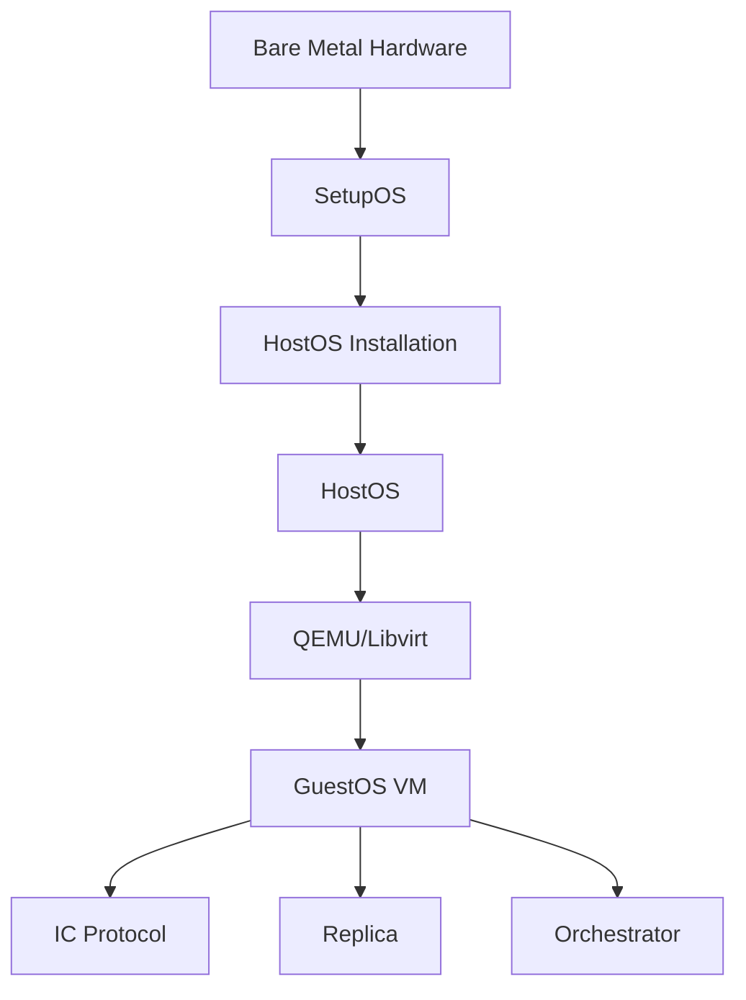

## Introduction

IC-OS is an umbrella term for all the operating systems within the Internet Computer, including SetupOS, HostOS, and GuestOS. Each operating system serves a specific purpose in the node infrastructure:

<CardGroup cols={3}>
  <Card title="SetupOS" icon="usb-drive" href="/ic-os/setupos">
    Boots new replica nodes and installs HostOS and GuestOS
  </Card>
  <Card title="HostOS" icon="server" href="/ic-os/hostos">
    Hypervisor that launches and runs GuestOS in a virtual machine
  </Card>
  <Card title="GuestOS" icon="microchip" href="/ic-os/guestos">
    Executes the core IC protocol inside a virtual machine
  </Card>
</CardGroup>

## Operating System Roles

### SetupOS

**SetupOS** is responsible for booting a new replica node and installing HostOS and GuestOS. It enables Node Providers to independently onboard their nodes by:

- Validating hardware components
- Testing network connectivity
- Preparing disk partitions
- Installing both HostOS and GuestOS

Once the installation is complete, the machine reboots into HostOS.

### HostOS

**HostOS** is the operating system that runs on the host machine. Its main responsibility is to launch and run the GuestOS in a virtual machine. In terms of its capabilities, HostOS is intentionally limited by design to not perform any trusted capabilities related to the Internet Computer Protocol.

Key characteristics:
- Runs on bare metal hardware
- Manages QEMU/libvirt virtualization
- Provides controlled communication via VSOCK
- Minimal attack surface with restrictive firewall rules

### GuestOS

**GuestOS** is the operating system that runs inside a virtual machine on the HostOS. The core IC protocol is executed within the GuestOS, including:

- Replica binary
- Orchestrator binary
- IC protocol services

The GuestOS virtual machine ensures a consistent runtime environment across various hardware platforms and provides a unified method for upgrading the IC software.

## Architecture

## Image Build Process

All IC-OS images are built using Bazel and follow a common build pipeline:

<Steps>
  <Step title="Docker Base Image">
    Install upstream Ubuntu packages in a reproducible manner using `Dockerfile.base`. Base images are built weekly and published to Docker Hub.
  </Step>
  <Step title="Docker Image Assembly">
    Build the main system using `Dockerfile`, which configures and assembles the disk image on top of the base image.
  </Step>
  <Step title="Image Transformation">
    Transform the Docker image into a bootable bare-metal or virtual-metal image for use outside containerization.
  </Step>
  <Step title="Binary Injection">
    Inject IC services, configuration, scripts, and binaries as a caching optimization.
  </Step>
</Steps>

Rather than relying on a full-blown upstream ISO image, IC-OS is assembled based on a minimal Docker image with only the required components. This approach allows for a minimal, controlled, and well-understood system - which is key for a secure platform.

<Note>
For detailed information about the build process, refer to the `icos_build` macro in `ic-os/defs.bzl`.
</Note>

## Development vs Production Images

Each IC-OS image has different build variants:

| OS | Variants |
|----|----------|
| SetupOS | `prod`, `dev` |
| HostOS | `prod`, `dev` |
| GuestOS | `prod`, `dev`, `dev-malicious`, `recovery` |

The key differences between variants:

- **Production (`prod`)**: Console access is disabled for security
- **Development (`dev`)**: Console access is enabled for debugging
- **Dev-Malicious**: Bundles the malicious replica for testing
- **Recovery**: Special recovery mode for GuestOS

<Warning>
All IC-OS `dev` images have the username and password set to `root` for development purposes.
</Warning>

## Managing IC-OS Files

To add or remove files from IC-OS builds:

<Tabs>
  <Tab title="Adding Files">
    1. Add your files to the `ic-os/components/` directory
    2. Enumerate each file in the corresponding `components/{guestos,hostos,setupos}.bzl` file
    3. Add a systemd service file if needed to start and control your service
  </Tab>
  <Tab title="Removing Files">
    1. Remove files from the `ic-os/components/` directory
    2. Remove the file enumeration from ALL `{guestos,hostos,setupos}.bzl` files that referenced them
  </Tab>
</Tabs>

<Note>
Certain binaries are injected into the image later in the build process, after the rootfs has been constructed. These can be found in the corresponding `defs.bzl` file for each OS.
</Note>

## Next Steps

<CardGroup cols={2}>
  <Card title="Building Images" icon="hammer" href="/ic-os/building-images">
    Learn how to build IC-OS images locally
  </Card>
  <Card title="SetupOS" icon="usb-drive" href="/ic-os/setupos">
    Deep dive into SetupOS installation process
  </Card>
  <Card title="HostOS" icon="server" href="/ic-os/hostos">
    Explore HostOS architecture and configuration
  </Card>
  <Card title="GuestOS" icon="microchip" href="/ic-os/guestos">
    Understand GuestOS and the IC protocol runtime
  </Card>
</CardGroup>
