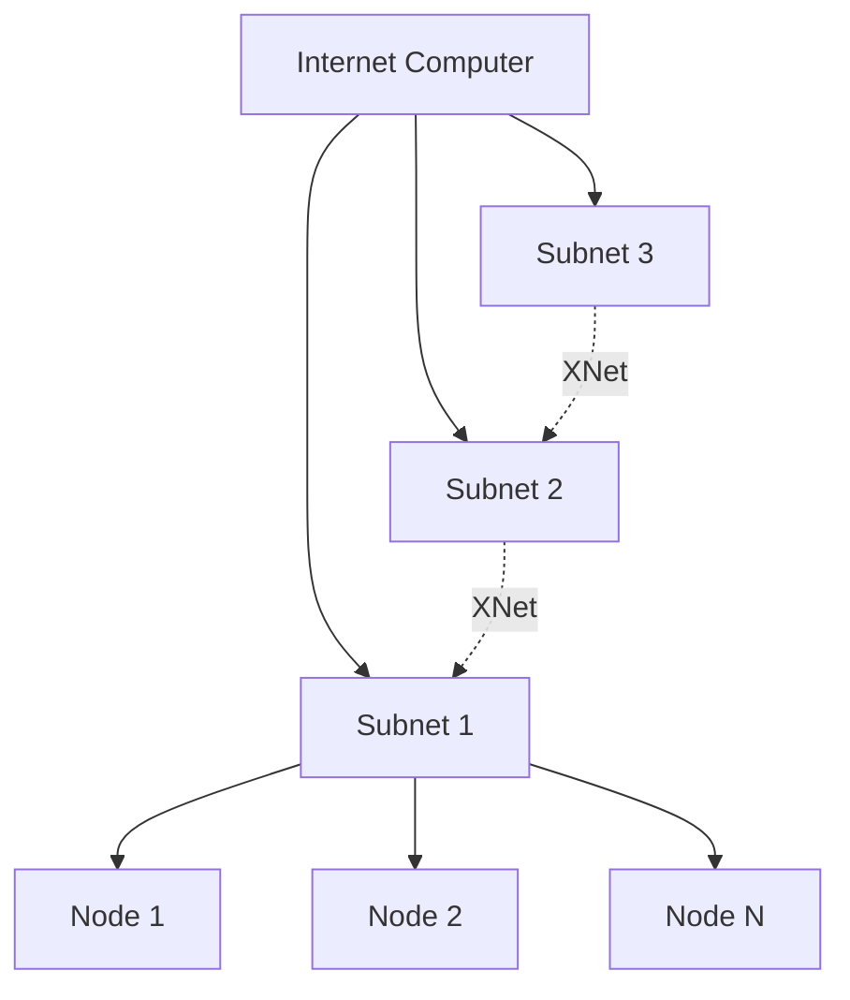

# Understanding the Internet Computer Protocol

The Internet Computer Protocol (ICP) is a revolutionary blockchain platform designed to host software and data on the public internet in a fully decentralized manner. This page explores its architecture, components, and design philosophy.

## The Vision: Autonomous Serverless Cloud

<Info>
**Project Description** (from Cargo.toml:542)

"Autonomous serverless cloud functionality for the public Internet."
</Info>

The Internet Computer reimagines cloud computing by replacing traditional corporate-owned servers with a decentralized network of node machines running the ICP protocol.

## Architecture Overview

The Internet Computer is built on several layers of abstraction:

### Layer 1: Node Machines

Independent node providers run standardized hardware in data centers worldwide. Each node runs:

- **SetupOS**: Boots new replica nodes and installs HostOS and GuestOS
- **HostOS**: Runs on the host machine, launches GuestOS in a virtual machine
- **GuestOS**: Runs inside a VM, executes the core IC protocol

<CodeGroup>
```plaintext IC-OS Structure
Node Machine
└── SetupOS (Initial boot)
    └── HostOS (Host layer)
        └── GuestOS (VM)
            └── Replica Process
                ├── Consensus
                ├── Execution
                ├── Message Routing
                └── Networking
```
</CodeGroup>

<Note>
**From ic-os/README.adoc:8-9**

"HostOS: The operating system that runs on the host machine. Its main responsibility is to launch and run the GuestOS in a virtual machine. In terms of its capabilities, it is intentionally limited by design to not perform any trusted capabilities."
</Note>

### Layer 2: The Replica

The replica is the Rust implementation of the Internet Computer protocol. It's a sophisticated piece of systems software that coordinates:

<Steps>
  <Step title="Consensus">
    Establishes agreement on the order of operations across all nodes in a subnet
  </Step>
  
  <Step title="Message Routing">
    Routes messages between canisters and across subnets (XNet)
  </Step>
  
  <Step title="Execution">
    Executes canister WebAssembly code in sandboxed environments
  </Step>
  
  <Step title="State Management">
    Maintains and certifies the replicated state
  </Step>
</Steps>

### Layer 3: Subnets

Nodes are organized into **subnet blockchains**:

- Each subnet is an independent blockchain
- Typically 13-40 nodes per subnet for Byzantine fault tolerance
- Subnets run consensus independently
- Communication across subnets via XNet messaging



### Layer 4: Canisters

Canisters are the smart contracts of the Internet Computer:

- Execute WebAssembly code
- Store persistent data
- Handle HTTP requests
- Communicate with other canisters

<Card title="Canister Isolation" icon="shield">
**From rs/canister_sandbox/README.md:3-5**

"All wasm execution are pulled out from the replica itself and pushed into separate processes, one per canister."

This provides strong isolation and security boundaries.
</Card>

## Core Components

### Consensus Engine

The consensus implementation resides in `rs/consensus/` and includes multiple coordinated subcomponents:

```rust
// From rs/consensus/src/consensus.rs:130-140
pub struct ConsensusImpl {
    notary: Notary,
    finalizer: Finalizer,
    random_beacon_maker: RandomBeaconMaker,
    random_tape_maker: RandomTapeMaker,
    block_maker: BlockMaker,
    catch_up_package_maker: CatchUpPackageMaker,
    validator: Validator,
    aggregator: ShareAggregator,
    purger: Purger,
    // ... additional fields
}
```

Each subcomponent has a specific role:

<AccordionGroup>
  <Accordion title="Block Maker">
    Proposes new blocks containing batches of messages to be executed
  </Accordion>
  
  <Accordion title="Notary">
    Creates notarization shares to validate proposed blocks
  </Accordion>
  
  <Accordion title="Finalizer">
    Produces finalization shares after blocks are notarized, making them immutable
  </Accordion>
  
  <Accordion title="Random Beacon Maker">
    Generates unpredictable randomness for block proposal selection
  </Accordion>
  
  <Accordion title="Validator">
    Validates all consensus artifacts before accepting them into the pool
  </Accordion>
</AccordionGroup>

### Execution Environment

The execution environment (`rs/execution_environment/`) manages canister lifecycle and execution:

- **Canister Manager**: Creates, upgrades, and manages canisters (see `rs/execution_environment/src/canister_manager.rs`)
- **WebAssembly Execution**: Runs canister code in isolated sandboxes
- **Cycles Accounting**: Manages computation and storage costs

### Cryptographic Components

ICP uses advanced cryptography throughout:

<CardGroup cols={2}>
  <Card title="Threshold Signatures" icon="key">
    Enable a subnet to sign with a single public key
  </Card>
  
  <Card title="Non-Interactive DKG" icon="shuffle">
    Distributed key generation without interactive rounds
  </Card>
  
  <Card title="Chain-Key Cryptography" icon="link">
    Enables instant finality and cross-chain integration
  </Card>
  
  <Card title="VetKD" icon="lock">
    Verifiable encryption and threshold key derivation
  </Card>
</CardGroup>

The crypto implementation spans multiple packages in `rs/crypto/`.

## System Requirements

<Warning>
**Minimum Requirements** (from README.adoc:79-83)

- **Architecture**: x86-64 based system
- **Memory**: Minimum 16 GB MEM/SWAP
- **Disk**: 100 GB available disk space
- **OS**: Ubuntu 22.04 or newer
- **Container Runtime**: [Podman](https://podman.io/getting-started/installation)
</Warning>

## The Cargo Workspace

The ICP implementation is a massive Rust workspace with 500+ crates:

```toml
# From Cargo.toml workspace structure
[workspace.package]
version = "0.9.0"
authors = ["The Internet Computer Project Developers"]
description = "Autonomous serverless cloud functionality for the public Internet."
documentation = "https://internetcomputer.org/docs/"
edition = "2024"
```

Key workspace members include:

- `rs/replica` - Main replica binary
- `rs/consensus` - Consensus protocol implementation
- `rs/execution_environment` - Canister execution
- `rs/messaging` - Message routing
- `rs/crypto` - Cryptographic primitives
- `rs/nns` - Network Nervous System canisters
- `rs/registry` - Network configuration registry

## Network Nervous System (NNS)

The NNS is the on-chain governance system that controls the Internet Computer:

<Info>
**From rs/nns/README.adoc:1-3**

"This directory is intended to contain the various canisters, and possibly command-line tools, used for decentralized control of the Internet Computer."
</Info>

The NNS manages:
- Network topology (adding/removing nodes and subnets)
- Protocol upgrades
- Node provider rewards
- Network economics (ICP token)

## Development Philosophy

### Reproducible Builds

All IC-OS images are built reproducibly, allowing anyone to verify that the running code matches the published source:

```bash
# Verify a release by proposal number
curl -fsSL https://raw.githubusercontent.com/dfinity/ic/{COMMIT_ID}/ci/scripts/repro-check | \
    python3 - -p <proposal_number>
```

### Security by Design

- **Process Isolation**: Canisters run in separate processes
- **Sandboxing**: WebAssembly provides memory safety
- **Minimal Attack Surface**: HostOS intentionally limited in capabilities
- **Defense in Depth**: Multiple security layers throughout the stack

### Performance Optimization

```rust
// From rs/replica/bin/replica/main.rs:98-103
// Multiple Tokio runtimes for component isolation
let rt_main = tokio::runtime::Builder::new_multi_thread()
    .worker_threads(rt_worker_threads)
    .thread_name("Main_Thread".to_string())
    .enable_all()
    .build()
    .unwrap();
```

The replica uses multiple async runtimes as a risk mitigation measure to prevent bugs in one component from blocking others.

## Next Steps

<CardGroup cols={2}>
  <Card title="Quickstart" icon="rocket" href="/quickstart">
    Build the replica and explore the codebase
  </Card>
  
  <Card title="Architecture Deep Dive" icon="microscope" href="/concepts/architecture">
    Explore the detailed system architecture
  </Card>
  
  <Card title="Consensus Protocol" icon="handshake" href="/concepts/consensus">
    Understand how nodes reach agreement
  </Card>
  
  <Card title="Canisters" icon="cube" href="/concepts/canisters">
    Learn about canister smart contracts
  </Card>
</CardGroup>